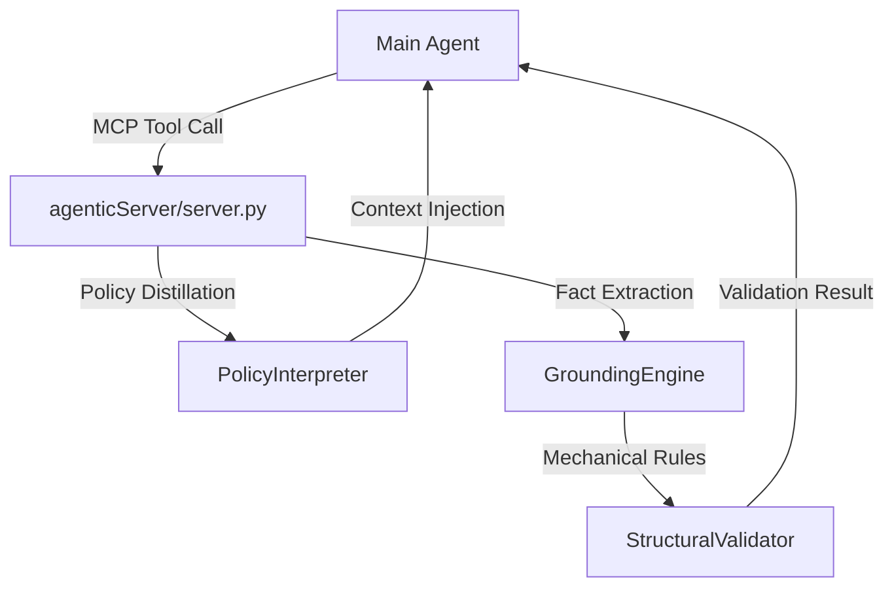

# Analyze-Skill Agentic Server (MCP-based)

기존의 정적 프롬프트 기반 `analyze-skill`을 동적 매커니즘인 `agenticServer` 구조로 전환한 프로젝트입니다.

## 1. 개요 (Architecture)
이 서버는 소스코드에서 확정적인 사실(Facts)을 로직으로 자동 추출하고, 거대한 규칙(MD) 문서에서 현재 필요한 지침만 동적으로 주입하여 분석의 정확성과 효율성을 극대화합니다.



## 2. 주요 기능 (Features)
- **동적 정책 주입 (`PolicyInterpreter`)**: 수백 라인의 규칙 파일(`protocols/*.md`)에서 현재 전문가(Expert)와 의도(Intent)에 딱 맞는 최소 지침만 정제해 주입합니다.
- **확정적 사실 추출 (`GroundingEngine`)**: `grep`, `file-parser` 등을 통해 소스코드의 물리적 구조와 패턴을 JSON 데이터로 즉시 확보합니다.
- **기계적 규칙 자동 검증 (`StructuralValidator`)**: `TMPDIR` 예약어 사용 금지, 분기 완결성 등 정답이 정해진 규칙은 LLM이 직접 찾지 않고 로직이 사전에 검증하여 보고합니다.

## 3. 실행 방법 (Run / Setup)

### 로컬 테스트 (Local Logic Test)
서버를 띄우지 않고 로직만 검증하려면 다음 스크립트를 참고하십시오.
```bash
python3 -c "from policy_interpreter import interpreter; print(interpreter.get_expert_protocol('LogicAuditor'))"
```

### MCP 서버 실행 (Developer Mode)
FastMCP 라이브러리가 설치된 환경에서 다음 명령어로 서버를 구동할 수 있습니다.
```bash
# server.py 경로: agenticServer/analyze-skill/server.py
# npx 혹은 mcp 실행기 사용 (설정에 따라 다름)
mcp start server.py
```

## 4. 제공 도구 (Tools Interface)

### `extract_facts(skill_dir: str)`
- 분석 대상 스킬의 모든 물리적 지표(Facts)와 자동 검출된 오류(`auto_detected_errors`)를 JSON으로 반환합니다.

### `get_rules(expert_name: str, intent: str = None)`
- 지정된 전문가와 의도에 맞는 압축된 분석 프로토콜을 마크다운 형식으로 반환합니다.

## 5. 디렉토리 구조 (Directory Structure)
- `server.py`: FastMCP 기반의 통합 분석 창구
- `protocols/`: 분석 정책 소스 (Knowledge Base)
- `core/`: 팩트 추출 및 검증을 담당하는 핵심 로직 (Python)
    - `grounding.py`: 사실 추출 엔진
    - `validator.py`: 기계적 규칙 검증 엔진
- `policy_interpreter.py`: 지침 정제(Distillation) 엔진
