# Test Skill Suite — 업그레이드 히스토리

> **대상 독자**: 테스트 스킬을 처음 접하거나, 왜 이런 구조가 됐는지 궁금한 분들
> **목적**: 아키텍처 결정의 배경과 진화 과정을 교육용으로 설명

---

## 1. 업그레이드 배경 — 왜 바꿨나?

### 1.1 원래의 문제들

#### 문제 1: 세션 시작 시 `_shared/` 전체 로드

메인 에이전트가 세션 시작 시 `_shared/` 폴더의 모든 파일을 한꺼번에 읽어서 컨텍스트에 올렸습니다. 이 내용은 세션이 끝날 때까지 컨텍스트를 점유하며, TC가 10개만 돼도 토큰이 폭발적으로 늘어났습니다.

#### 문제 2: 스캐폴드 템플릿이 init.md 안에 인라인

`test-init.md`가 신규 프로젝트 초기화 시 생성할 파일의 내용을 **직접 포함**하고 있었습니다. 초기화와 무관한 테스트 실행 시에도 이 내용이 토큰을 소모했습니다.

#### 문제 3: 파일명 혼란

`테스트_환경_공통.md` 하나에 서버 URL과 실행 규칙이 함께 들어 있었습니다. URL이 필요한 Step(1, 4, 5)과 실행 규칙이 필요한 Step(5)이 달라서 필요한 것만 로드하는 최적화가 불가능했습니다.

#### 문제 4: `_rules/` vs `_shared/rule/` 역할 불명확

두 폴더 모두 "규칙"을 담고 있어서, 어디에 무엇을 넣어야 하는지 혼란이 있었습니다.

---

### 1.2 Before 아키텍처 — 문제점 시각화

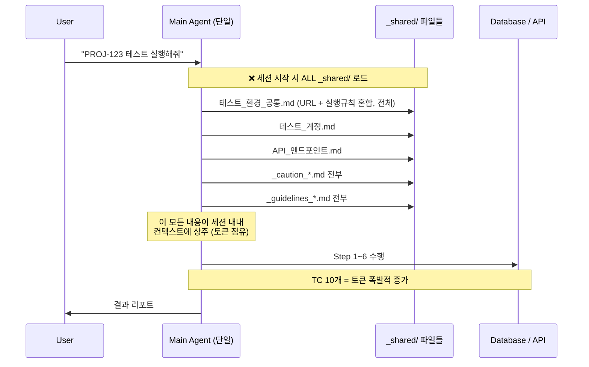

**핵심 문제**: "나중에 필요할 것 같아서" 미리 다 읽어두는 방식은 토큰 낭비입니다. 에이전트가 각자 필요한 것만 읽어야 합니다.

---

## 2. 핵심 아키텍처 결정 7가지

- **결정 1: 서브에이전트 모델 (v4.0)** - 메인 컨텍스트 보호를 위해 Non-interactive 성격의 단계를 서브에이전트로 분리.
- **결정 2: File-as-State (v4.0)** - 에이전트 간 상태 공유는 오직 파일로만 수행하여 토큰 점유 최소화.
- **결정 3: Self-declaring Dependencies (v6.4)** - 스킬 구성 요소 스스로 의존성을 매니페스트에 선언하여 자동 탐색 가능하게 함.
- **결정 4: Pipeline State Machine (v6.5)** - 단계별 실행 상태를 원자적으로 기록하여 장애 시 즉각 복구 가능하게 함.
- **결정 5: Repo Registry & Reconnaissance (v6.7)** - 물리적 경로 대신 논리적 레지스트리로 서비스를 탐색하여 환경 독립성 확보.
- **결정 6: Hybrid UI Testing (v6.1)** - LLM 추론(`agent-browser`)과 엔진 실행(`Playwright`)의 역할을 분리하여 유연성/성능 동시 확보.
- **결정 7: CLI-First Execution for Performance (v6.8)** - MCP 오버헤드 제거를 위한 CLI 직접 제어 도입.
- **결정 8: Centralized Playwright Skill (`playwright_utils`) (v6.8)** - Playwright CLI 및 브라우저 관리를 독립적인 `playwright_utils` 스킬로 격리하여 재사용성 및 환경 독립성 확보.

---

### 결정 1: 서브에이전트 모델 — Interactive vs Non-interactive 분리

#### 왜?

파이프라인의 각 Step을 들여다보면 성격이 뚜렷하게 나뉩니다.

| Step                 | 성격                                    | 이유                              |
| -------------------- | --------------------------------------- | --------------------------------- |
| Step 1 (Gate)        | **Interactive** — Main 직접 처리        | 사용자 의사결정(Q1, Q2) 필요      |
| Step 2 (Sheet Check) | **Interactive** — Main 직접 처리        | REUSE/REPLAN/NEW 판정             |
| Step 5 (Execute)     | **Interactive** — Main 직접 처리        | 실시간 피드백, Tier 간 Sync       |
| Step 0 (Init)        | **Non-interactive** — 서브에이전트 가능 | Workspace 검증은 사람 개입 불필요 |
| Step 3 (Plan)        | **Non-interactive** — 서브에이전트 가능 | 시트 생성은 독립 실행 가능        |
| Step 4 (Data)        | **Non-interactive** — 서브에이전트 가능 | DB 검색은 독립 실행 가능          |
| Step 6 (Report)      | **Non-interactive** — 서브에이전트 가능 | 보고서 생성은 독립 실행 가능      |

Non-interactive Step은 **서브에이전트**(Task tool)로 위임하면 Main 컨텍스트를 오염시키지 않습니다.

#### 역할 분리 다이어그램

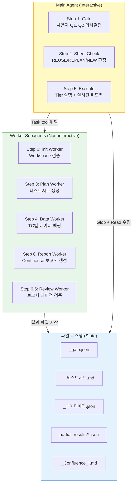

**핵심 통찰**: 서브에이전트는 파일을 통해 상태를 공유합니다. 메모리(ctx)를 공유할 수 없지만, 파일은 공유할 수 있습니다.

---

### 결정 2: Self-declaring Dependencies (자기선언 의존성)

#### 왜 외부 Manifest를 거부했나?

처음에는 별도의 `manifest.json`을 두고 "이 Step은 이 파일들을 로드한다"고 선언하는 방안을 검토했습니다. 그러나 두 가지 문제가 있었습니다.

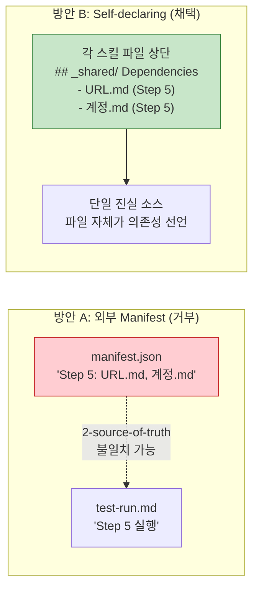

**2-source-of-truth 문제**: manifest.json과 스킬 파일이 따로 관리되면, 스킬 파일에서 새 파일을 읽도록 수정해도 manifest를 업데이트하지 않아 불일치가 생깁니다.

**Self-declaring 방식**: 각 스킬 파일 상단에 `## _shared/ Dependencies` 섹션을 두고, 자신이 어떤 파일을 언제 읽는지 선언합니다. 파일 자체가 명세입니다.

---

### 결정 3: 템플릿 분리 — 스캐폴드 내용을 test-init.md에서 분리

#### Before: 인라인 템플릿

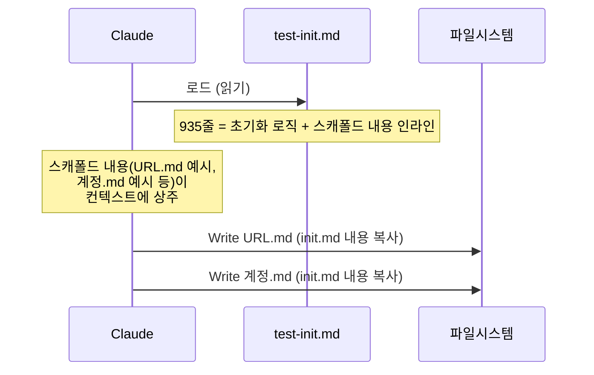

**문제**: 초기화와 무관한 일반 테스트 실행 시에도 스캐폴드 내용 전체가 init.md를 통해 컨텍스트에 올라옵니다.

#### After: 템플릿 분리

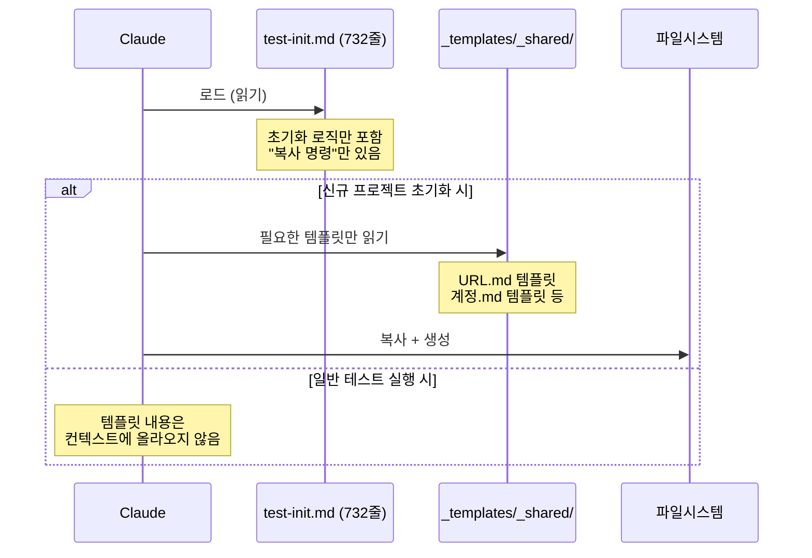

**효과**: init.md가 935줄 → 732줄로 감소. 더 중요한 것은 스캐폴드 내용이 "필요할 때만" 로드됩니다.

---

### 결정 4: Git State-based Caching (의미적 실행 건너뛰기)

#### 왜?

코드 변경이 없는데도 매번 전체 테스트 스위트를 재실행하는 것은 막대한 시간과 비용을 낭비합니다. 하지만 단순히 파일 수정 시간(mtime)만 보면 가공된 파일이나 불필요한 공백 변경에도 테스트가 다시 돌아가는 문제가 있었습니다.

#### 아키텍처적 접근

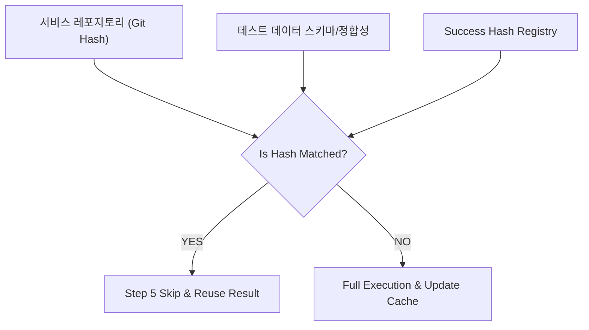

**핵심 가치**: 테스트 실행 여부를 **'의미적 상태(Semantic State)'**에 결합시켰습니다. Git Hash가 같으면 에이전트는 무모한 재실행 대신 기존 성공 결과를 신뢰합니다.

---

### 결정 5: Repo Registry & Adaptive Reconnaissance (전역 탐색)

#### 왜?

대규모 멀티 레포 환경에서 에이전트가 로컬 파일 시스템만 뒤지는 것은 한계가 있었습니다. 로컬에 폴더가 없으면 에이전트는 "코드가 없다"고 판단하고 포기해버립니다.

#### 아키텍처적 접근

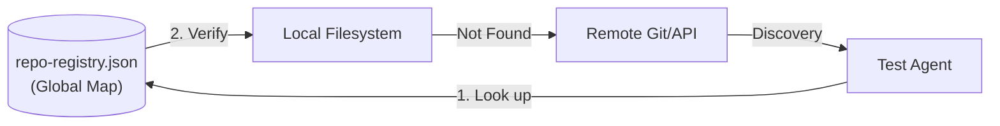

**핵심 가치**: **'로컬 의존적 탐색'**에서 **'글로벌 레지스트리 기반 정찰'** 모델로 전환했습니다. 에이전트는 이제 로컬에 코드가 없어도 당황하지 않고, 전역 지도를 보고 원격에서 정보를 찾아와 테스트 설계를 계속할 수 있습니다.

---

### 결정 6: Hybrid UI Testing (Playwright + Agent-browser)

#### 왜?

전통적인 E2E 도구(Playwright, Selenium)는 로케이터(Locator)가 바뀌면 스크립트가 깨지는 유지보수 비용이 큽니다. 반면, LLM 브라우저 에이전트(`agent-browser`)는 유연하지만 실행이 느리고 토큰 비용이 높습니다.

#### 결정 7: CLI-First Execution for Performance (v6.8)
- **배경**: Playwright MCP 서버는 도구 호출 시마다 세션 초기화 및 상태 동기화 오버헤드가 발생하여 실시간 응답성이 떨어짐.
- **해결**: `agent-browser` CLI와 Playwright Python/Node CLI를 직접 연동하는 구조로 전환.
- **연동 메커니즘**:
  1. **탐색(Sense)**: `npx agent-browser get-page` CLI를 통해 AXTree(평면화된 DOM)를 0.5초 내에 추출.
  2. **추론(Plan)**: 추출된 AXTree를 기반으로 LLM이 필요한 Selector를 식별하고 Playwright 실행 코드를 생성.
  3. **실행(Act)**: 생성된 코드를 `run_command`를 통해 `python3` 또는 `npx playwright test`로 직접 실행.
- **가치**: MCP 레이어를 우회함으로써 UI 테스트 실행 속도를 비약적으로 향상시키고, 병렬 실행 시의 리소스 경합을 최소화함.

#### 아키텍처적 접근

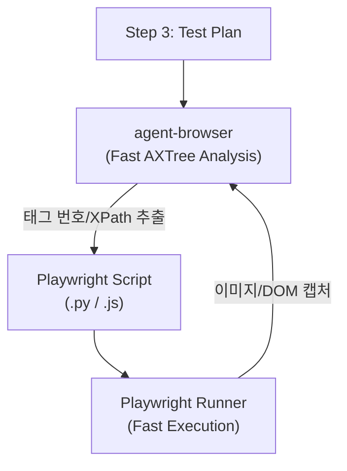

**핵심 가치**: **'LLM의 추론(agent-browser)'**과 **'엔진의 속도(Playwright)'**를 결합했습니다. 에이전트는 AXTree를 통해 타겟 요소를 초고속으로 식별하고, 실제 실행은 Playwright 스크립트로 위임하여 안정성과 속도를 동시에 확보했습니다.

---

## 3. `_rules/` vs `_shared/rule/` 역할 분리

두 폴더는 이름이 비슷하지만 성격이 완전히 다릅니다.

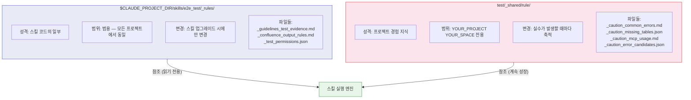

| 구분         | `_rules/`                      | `_shared/rule/`               |
| ------------ | ------------------------------ | ----------------------------- |
| **소유자**   | 스킬 개발자                    | 테스트 팀 (YOUR_PROJECT)      |
| **내용**     | Pass/Fail 판정 기준, 출력 포맷 | DB 오류 패턴, MCP 제한사항    |
| **생명주기** | 스킬 버전과 함께 관리          | 실수가 발생할 때마다 업데이트 |
| **이식성**   | 다른 프로젝트에도 그대로 사용  | YOUR_PROJECT에만 의미 있음    |
| **비유**     | 교과서 (불변)                  | 현장 메모장 (계속 성장)       |

**한 줄 요약**: `_rules/`는 "어떻게 테스트해야 하는가", `_shared/rule/`는 "이 프로젝트에서 조심할 것들"입니다.

---

## 4. After 아키텍처 — 어떻게 바뀌었나?

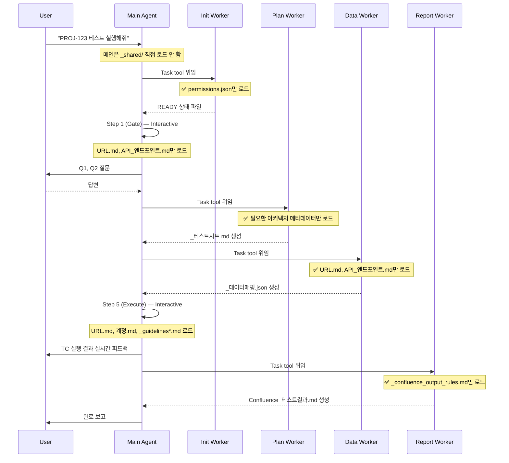

**핵심 변화**: 각 서브에이전트가 자신의 Step에 **필요한 파일만** 선택적으로 로드합니다. 메인 컨텍스트는 최소한의 상태만 유지합니다.

---

## 5. 파일별 변경 요약

| 파일                            | 변경 전 | 변경 후 | 주요 변경 내용                                       |
| ------------------------------- | ------- | ------- | ---------------------------------------------------- |
| `test-init.md`                  | 935줄   | 732줄   | 스캐폴드 템플릿을 `_templates/`로 분리               |
| `test-run.md`                   | 994줄   | 884줄   | ASCII Workflow → 테이블 형식, 서브에이전트 원칙 추가 |
| `test-evidence.md`              | 303줄   | 53줄    | 상세 내용 → `_rules/` 파일 참조로 대체               |
| `test-scheduler.md`             | 268줄   | 115줄   | pseudo-code 3개 → 1줄 설명 (LLM 해석으로 충분)       |
| `test-workspace-conventions.md` | 306줄   | 251줄   | Runtime Preflight → 서브에이전트 모델로 교체         |

> **왜 줄어드는 게 좋은가?** 스킬 파일 자체도 매번 읽힙니다. 파일이 작을수록 오케스트레이터 로드 비용이 줄어듭니다.

---

## 6. `_shared/env/` File Migration

구 버전의 파일명은 프로젝트명(`PROJECT_`)을 접두사로 달고 있어서, 다른 프로젝트로 복사할 때 혼란이 있었습니다. 신 버전은 역할 기반 표준 이름을 사용합니다.

| 구 이름                       | 신 이름             | 변경 이유                        |
| ----------------------------- | ------------------- | -------------------------------- |
| `PROJECT_테스트_서버_url.md`  | `url.md`            | 프로젝트 무관 표준화             |
| `PROJECT_테스트_환경_공통.md` | `실행_규칙.md`      | URL과 실행규칙 분리, 역할 명확화 |
| `PROJECT_테스트_accounts.md`      | `accounts.md`           | 프로젝트 무관 표준화             |
| `PROJECT_API_엔드포인트.md`   | `API_엔드포인트.md` | 프로젝트 무관 표준화             |

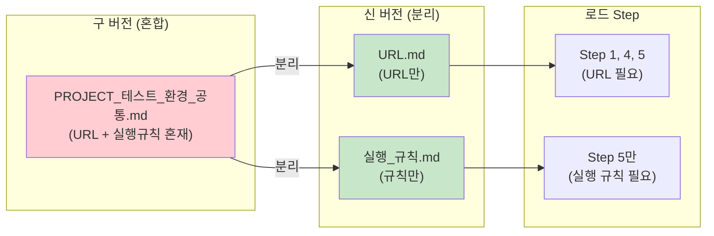

**효과**: Step별로 정확히 필요한 파일만 로드할 수 있게 됩니다. URL이 필요한 Step에서 실행 규칙을 함께 읽을 필요가 없어집니다.

---

## 7. 파이프라인 최적화 (v6.5)

최근 업그레이드를 통해 오케스트레이터의 견고함을 더욱 강화하기 위해 다음 세 가지 핵심 최적화가 적용되었습니다.

### 7.1 JSON Schema Integration

하드코딩된 Python 기반의 포맷 검증에서 벗어나, `_rules/` 디렉터리에 JSON Schema를 통합 도입했습니다. 훅 스크립트(`validate_*.py`)는 단순 파서(Parser) 역할만 수행토록 응집도를 높이고, 검증 단계를 선언적 스키마로 분리하여 뛰어난 유지보수성을 확보했습니다.

### 7.2 Pipeline State Machine

단순한 절차적 스크립팅 위주의 실행을 넘어 명확한 상태 기계(State Machine) 모델로 전환했습니다. 각 하위 서브에이전트의 명시적 파일 출력 결과(상태값)에 의존해 오케스트레이터가 다음 분기 및 중단/재개를 결정하므로, 안정적인 재실행(Resilience) 및 단계적 복구(Resume)가 용이합니다.

### 7.3 Artifact Garbage Collection

기존에 성공 또는 실패했던 테스트 생성물들의 찌꺼기(`partial_results/*.json`, 실행 계획 찌꺼기 등)가 후속 테스트 실행 시 `test-reporter`의 결과 수집을 오염시키는 문제를 원천 차단했습니다. `test-run` ಪ್ರಾರಂಭ 및 시트 `REPLAN` 시점에 즉시 잔여물들을 폐기하는 자동 Garbage Collection 메커니즘을 추가했습니다.

---

## 8. 교훈 (Lessons Learned)

### "파일이 곧 상태다"

서브에이전트는 메모리(ctx)를 공유할 수 없습니다. 파일이 유일한 통신 채널입니다. 따라서 각 Step이 어떤 파일을 만들고(Write), 다음 Step이 어떤 파일을 읽는지(Read) 명확하게 설계해야 합니다.

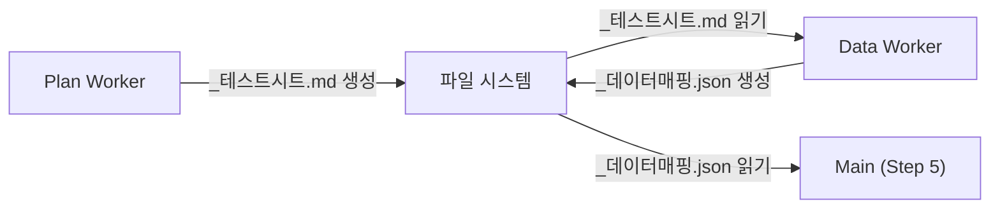

### "단일 진실 소스"

두 군데에 같은 정보를 관리하면 반드시 불일치가 생깁니다. 외부 Manifest를 거부하고 Self-declaring Dependencies를 채택한 이유입니다. 스킬 파일이 자신의 의존성을 직접 선언하면, 스킬 파일만 수정하면 됩니다.

### "Glob 비용 ≈ 0, Read 비용 = 실질 토큰"

파일 경로 탐색(Glob)은 거의 비용이 없습니다. 실제 토큰을 소모하는 것은 파일 내용을 읽는 것(Read)입니다. "어떤 파일이 있는지 확인"은 아무리 해도 되지만, "파일 내용 읽기"는 꼭 필요할 때만 해야 합니다.

### "인덱싱이 곧 속도다"

에이전트에게 낱개 파일을 던져주고 "찾아봐"라고 하는 것보다, `repo-registry.json`처럼 미리 정리된 인덱스를 주는 것이 훨씬 빠르고 정확합니다. 에이전트의 사고 비용을 줄이는 데이터 구조 설계가 성능의 핵심입니다.

### "환경 격리가 곧 안정성이다"

파이프라인 상태 머신과 GC를 통해 이전 실행의 흔적을 철저히 지우는 것은 결벽증이 아니라 안정성을 위한 필수 조건입니다. 지저분한 상태는 에이전트에게 환각(Hallucination)을 일으키는 가장 큰 원인이 됩니다.

---

## 9. 버전별 주요 아키텍처 변경 타임라인

```mermaid
timeline
    title Test Skill 아키텍처 진화
    2026-02-13 : v3.0 단일 오케스트레이터 통합
               : Jira-First Gate 도입
    2026-02-14 : v5.0 Gate v4.0 반영 (서비스 탐색, 서버 접속 확인, 모바일 시뮬레이션 익스포트)
    2026-02-18 : v5.5 Step 4 (Data v2.0) 선언적 SQL Stimulus 추출 도입
    2026-02-20 : v6.0 Step 7 (Post-run) 추가 및 test-reporter v3.0 통합
    2026-02-21 : v6.1 서브에이전트(Worker Agent) 위임 모델 최초 도입
    2026-02-22 : v6.3 Write-Through + Read-Through Cache 상태 관리 패턴 정립
    2026-02-23 : v6.4 Self-declaring Dependencies (Manifest 제거 및 스킬 헤더 통합)
               : Step 3.5 Checkpoint & Step 6.5 Review Agent 신규
               : README/ARCHITECTURE/HOOKS 문서 체계 분리
    2026-02-25 : v6.5 JSON Schema 기반 검증 병합 (validate_*.py 로직 분리)
               : Pipeline State Machine 확립 (Resilience 강화)
               : Artifact Garbage Collection 도입 (상태 오염 방지)
    2026-03-09 : v6.6 Git State 기반 유효성 캐싱 도입 (로컬 변경 지원)
               : Vercel agent-browser 통합 기반 하이브리드 UI 테스트
               : 프로젝트 종속 참조 익명화 및 문서 범용성 강화
                : 하이브리드 서비스 탐색 (Repo Registry)
                : 티켓 ID 정밀 파싱 ((?!\\d)) 및 폴더 재사용
    2026-03-12 : v6.8 Playwright CLI Skill Extraction
               : playwright_utils 스킬로 브라우저 제어 로직 분리
               : CLI 직접 실행을 통한 성능 최적화
    2026-03-13 : v7.0 Platform-Agnostic Generalization
               : Jira/Confluence 종속성 제거 및 IMS/Report Provider 체계 도입
               : v2.3 주요 기능(Signature Mapping, samples/) 완벽 복구
               : Post-processing 액션 범용화 및 HITL Checkpoint 강화

---

## 10. Upgrade History

## v2.3.5 (2026-03-18)

### Sync & Stability
- **Cross-Skill Sync**: service metadata consumer/producer 간 참조 규격 동기화를 강화했습니다.
- **Path Verification**: 인덱싱 파이프라인의 전역 경로 참조 안정성 강화.

## v2.3.4 (2026-03-17)

### English Localization of Test Templates
- **Standardized paths**: `test/_shared/env/` (from `환경/`), `test/_shared/domain/` (from `도메인/`)
- **Normalized filenames**:
  - `accounts.md` (from `계정.md`)
  - `url.md` (from `URL.md`)
  - `execution_rules.md` (from `실행_규칙.md`)
  - `api_endpoints.md` (from `API_엔드포인트.md`)
- **Documentation Sync**: Updated all orchestrators and guidelines to use the new English standard.

### [v2.3.3] - 2026-03-17
#### Added
- **🌐 Universal Browser Intent**: 플랫폼 내장 도구(Subagent)와 Playwright CLI를 병합하여 지능형 브라우저 제어 및 고화질 레코딩(WebP) 증거 수집 체계 구축.
- **🖼️ Enhanced Visual Evidence**: 보고서 내 동영상 레코딩(WebP) 임베딩 및 자산 관리 자동화 규칙 적용.

### [v2.3.2] - 2026-03-17
#### Added
- **Global Path & Dependency Unification**: 도구 호출 명령어 표준화($CLAUDE_PROJECT_DIR) 및 아키텍처 메타데이터 경로 통일.
- **Provisioning Review Checkpoint**: 데이터 생성 전 사용자 승인 단계 추가.
- **Artifact Garbage Collection**: 테스트 완료 후 임시 스크립트 및 잉여 파일을 정리하는 Cleanup 로직 도입.

### [v2.3.3] - 2026-03-18
#### Changed
- **Service Metadata Provider Abstraction**: `e2e_test`는 특정 메타데이터 생성 스킬을 알지 않고, Step 0에서 `ctx.service_metadata`를 해석하여 file/cli/rag/mcp provider를 공통 인터페이스로 사용합니다.

### [v2.3.1] - 2026-03-16
#### Changed
- **Compatibility Fix**: Claude Code 도구 규약(`Bash`, `Read` 등)을 `SKILL.md`에 추가하여 플랫폼 간 실행 호환성을 확보했습니다.

### [v2.3.0] - 2026-03-16
#### Changed
- **Unified Path Migration**: 모든 내부 경로를 `.claude/skills/`에서 최신 플러그인 전용 폴더인 `skills/e2e_test/`로 정규화했습니다.
- **Global Skill Suite Versioning**: 개별 스킬 버전을 전체 플러그인 버전인 `2.3.0`에 동기화했습니다.

### [v7.0.0] - 2026-03-13
#### Added
- **Platform-Agnostic Generalization**: Jira/Confluence에 고정되었던 명칭을 IMS/Report Provider 체계로 전면 전환.
- **IMS Provider Abstraction**: ClickUp, GitHub Issues 등 다양한 이슈 관리 도구 지원을 위한 인터페이스 표준화 (`issue_digest`).
- **Reporting Provider Abstraction**: Confluence 외의 Wiki나 local_copy 등 보고서 발행 타겟 다변화 (`publish-report`).
- **v2.3 Feature Restoration**: 유실되었던 `samples/` 폴더 기반 데이터 재활용 및 `structural_signatures` 매핑 기능 완벽 복구.
- **HITL Checkpoint 강화**: 테스트 계획 검토, 중요 후처리 액션 실행 전 사용자 승인 단계(Human-in-the-Loop) 명시화.
- **Versioning Consolidation**: 개별 서브 스킬(`test-*`)의 버전 관리를 폐지하고 `SKILL.md` 기반의 통합 버전 관리 체계 도입.

### [v6.8] - 2026-03-12
#### Added
- **Centralized Playwright Skill (`playwright_utils`)**: Playwright CLI 제어 및 브라우저 관리 로직을 독립적인 `playwright_utils` 스킬로 추출.
- **CLI-First Execution Strategy**: MCP 서버 오버헤드를 우회하여 `run_command`를 통해 브라우저 에이전트 및 Playwright를 직접 실행함으로써 비약적인 성능 향상.
- **Version & Documentation Sync Rules**: 모든 스킬 코드 수정 시 버전 업데이트 및 관련 문서(`ARCHITECTURE.md`, `UPGRADE_HISTORY.md`) 동기화를 강제하는 에이전트 가이드라인 수립.

### [v6.7] - 2026-03-12
#### Added
- **Repository Registry & Remote Reconnaissance**: 로컬에 부재하는 서비스 레포지토리를 `repo-registry.json` 기반 원격 API/Git URL을 통해 탐색할 수 있는 프로세스 도입.
### Technical Deep-dive: v6.7 Repo Registry & Reconnaissance
*   **어떤 고민 (Why)**: 여러 레포지토리가 얽힌 마이크로서비스 환경이나 거대한 모노레포에서, 필요한 코드가 로컬에 있는지 혹은 원격에 있는지 매번 수동으로 확인하고 탐색하는 과정(`find`, `grep`)은 에이전트의 사고 흐름을 끊고 높은 탐색 비용을 발생시켰습니다.
*   **어떻게 접근 (Approach/How)**: **'레포지토리 서비스 센터'** 개념의 레지스트리를 구축했습니다.
    *   **Repo Registry**: 로컬에 설정된 레포지토리 목록과 원격(Git URL) 정보를 `repo-registry.json`에서 통합 관리하여, 에이전트가 단 한 번의 조회로 위치를 파악할 수 있게 했습니다.
    *   **Discovery Automation**: 로컬에 없는 레포지토리를 발견할 경우 사용자에게 Git 클론을 제안하거나 원격 데이터를 직접 참조하는 '정찰(Reconnaissance) 로직'을 자동화하여 탐색 병목을 제거했습니다.
- **Verification Routine (Abort/Skip)**: 레포지토리 유효성 체크 실패 시 사용자 선택(중단 혹은 스킵)을 통한 실행 제어 로직 추가.
- **Ticket ID Precision Parsing**: 정규식 `([A-Z]+-\d+)(?!\d)` 도입을 통해 숫자 종결성(Numeric Termination)을 확보하고 ID 충돌 방지.
- **1-Ticket-1-Folder Resolution**: 티켓별 작업 폴더를 물리적으로 격리하고, 기존 폴더 존재 시 리소스를 재사용하는 `RESOLVE` 알고리즘 공식화.

### [v6.6] - 2026-03-09
#### Added
- **Git State-based Execution Caching**: 서비스 레포지토리의 Git Hash 변화를 감지하여 변경이 없는 경우 테스트 실행을 스킵하는 최적화 레이어 도입.
### Technical Deep-dive: v6.6 Git State-based Caching
*   **어떤 고민 (Why)**: 코드에 변경이 없거나 미미한 경우에도 매번 전체 테스트 스위트를 재실행하는 것은 막대한 시간과 AI 서비스 비용(Token)을 낭비하는 일이었습니다. 특히 대규모 프로젝트에서는 실행 시간이 기하급수적으로 늘어나는 문제가 있었습니다.
*   **어떻게 접근 (Approach/How)**: **'변경 감지 기반의 스킵(Skip-on-No-Change)'** 전략을 수립했습니다.
    *   **Semantic Hashing**: 테스트 대상 코드의 Git Hash를 추적하여, 해당 해시값이 마지막 성공 기록과 일치하면 실행 단계를 건너뛰고 기존 결과 리포트를 재사용합니다.
    *   **Data Integrity Mapping**: 단순 코드 해시뿐만 아니라 테스트 데이터의 정합성까지 매핑하여, '동일한 코드 + 동일한 데이터' 조건에서만 캐시를 트리거하도록 설계하여 테스트 신뢰도를 유지했습니다.
- **Vercel agent-browser UI Hybrid Testing**: API/DB 검증에 그치지 않고 실제 브라우저 에이전트를 통한 UI 인터랙션 및 시각적 검증 시나리오 통합.
- **Schema-aware Provisioning Payload Inference**: DB 스키마 분석 정보를 활용하여 테스트 데이터 프로비저닝 시 더 정확한 페이로드 추론 기능 강화.
- **Mermaid Flow Diagram Rendering**: 시스템 아키텍처 및 데이터 흐름 가시화를 위한 Mermaid 문법 지원.

#### Changed
- **System Anonymization**: platform-x, core-system 등 특정 도메인 서비스명에 대한 완전 익명화 수행 및 범용적 아키텍처 문서 체계 개편.

### [v6.5] - 2026-02-25
#### Added
- **Pipeline State Machine Integration**: 파이프라인 단계를 노드로 관리하여 복구 능력을 강화한 상태 머신 도입.
- **Artifact Garbage Collection**: 불필요한 테스트 잔여물을 자동 정리하는 최적화 로직 추가.

### Technical Deep-dive: v6.5 Pipeline State Machine & GC
*   **어떤 고민 (Why)**: 장기 실행되는 테스트 파이프라인 도중 오류 발생 시 처음부터 다시 시작해야 하는 비효율성과 테스트 산출물들의 오염을 방지하고자 했습니다.
*   **어떻게 접근 (Approach/How)**: 파이프라인을 **'상태 기반 머신(State Machine)'**으로 전환하고 데이터 생명주기를 관리합니다.
    *   **Execution Checkpoints**: 각 단계의 산출물을 중간 파일로 저장하여 실패 지점부터 재개(Resume)할 수 있는 안정성을 확보했습니다.
    *   **Tiered Garbage Collection**: 단계별로 생성된 임시 데이터를 자동 정리하여 스토리지 오염을 방지합니다.

### [v6.4] - 2026-02-23
#### Added
- **Self-declaring Dependencies**: 중앙 집중식 `manifest.json`을 폐기하고 각 스킬 파일 상단에 의존성을 직접 기술하는 구조로 전환.
- **Micro-Verification Agents**: Step 3.5(Checkpoint) 및 Step 6.5(Review Agent)를 추가하여 단계별 결과물의 정합성 상호 검증 강화.
- **Documentation Restructuring**: 단일 `README`에서 `ARCHITECTURE.md`, `HOOKS.md`, `UPGRADE_HISTORY.md`로 지식 기반 물리적 분리.

### Technical Deep-dive: v6.4 Self-declaring Dependencies
*   **어떤 고민 (Why)**: 시스템 확장 시 중앙 집중식 Manifest 관리가 유지보수의 병목이 되는 문제를 해결하고 싶었습니다.
*   **어떻게 접근 (Approach/How)**: **'스킬의 자급자족(Self-contained)'** 구조를 위해 선언 기반 의존성 해결 방식을 도입했습니다.
    *   **Skill-based Declaration**: 각 스킬 파일이 필요한 MCP 서버와 로컬 파일을 스스로 선언하도록 하여 스킬 간 결합도를 낮췄습니다.

### [v6.1] - 2026-02-21
#### Added
- **Worker Agent Delegation Model**: Non-interactive 단계(Step 0, 3, 4, 6)를 서브에이전트로 위임하여 메인 컨텍스트 오염을 방지하는 구조 확립.

### Technical Deep-dive: v6.1 Sub-agent Delegation
*   **어떤 고민 (Why)**: 메인 에이전트의 컨텍스트 윈도우 소진으로 인한 추론 능력 저하 문제를 해결하고자 했습니다.
*   **어떻게 접근 (Approach/How)**: **'작업의 격리'**를 위해 위임 모델을 채택했습니다.
    *   **Interactive vs. Worker Split**: 대화형(Main)과 작업형(Worker) 역할을 분리하여 컨텍스트를 최적화했습니다.
    *   **File-as-State**: 작업 결과를 파일로 전달하여 메인 에이전트의 대화 이력을 깨끗하게 유지합니다.

### [v6.0] - 2026-02-20
#### Added
- **Post-run Pipeline (Step 7)**: 테스트 종료 후 리소스 정리 및 환경 복구를 위한 전용 레이어 추가.
- **test-reporter v3.0 Integration**: Confluence 호환성 및 다중 TC 결과 집계 성능 개선.

### [v5.0] - 2026-02-14
#### Added
- **Active Service Exploration (Gate v4.0)**: 단순 메타데이터 분석을 넘어 서버 접속성 확인 및 모바일 API 시뮬레이션 환경 유효성 체크 도입.
- **Service Dependency DAG Extraction**: 서비스 간 연관 관계를 분석하여 병렬 실행 가능한 단위를 도출하는 로직 기초 설계.

### Technical Deep-dive: v5.0 Active Exploration
*   **어떤 고민 (Why)**: 불안정한 환경으로 인한 의미 없는 테스트 실패를 방지하고 싶었습니다.
*   **어떻게 접근 (Approach/How)**: 테스트 시작 전 **'사전 탐색 단계'**를 대폭 강화했습니다.
    *   **Service Discovery**: 실제 API 엔드포인트의 가용성과 연결성을 런타임에 동적으로 확인합니다.
    *   **Alignment Check**: 기획 요구사항과 실제 코드의 기술적 구현 능력이 일치하는지 선제적으로 대조합니다.

---

_이 문서는 테스트 스킬의 아키텍처 결정을 이해하기 위한 교육 자료입니다. 실제 실행 방법은 [../README.md](../README.md)를, 상세 설계는 [ARCHITECTURE.md](ARCHITECTURE.md)를 참조하세요._
