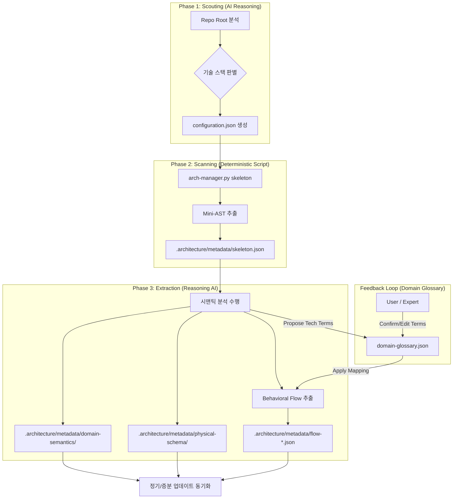
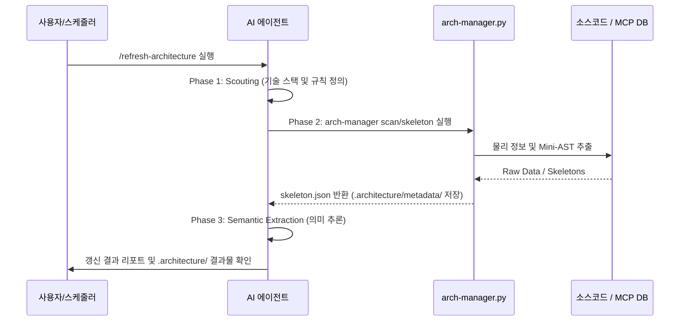
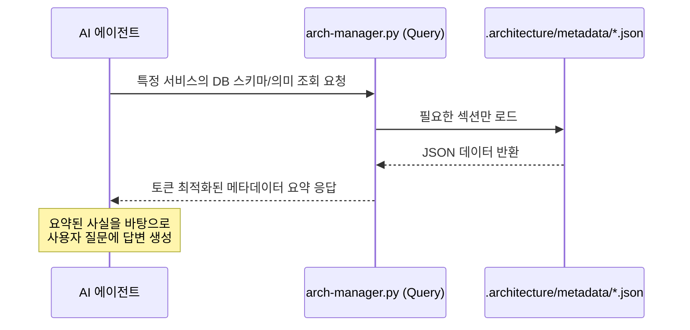

# 🏗️ Architecture Refresh 상세 설계

본 문서는 `refresh-architecture` 스킬의 내부 동작 메커니즘, 데이터 흐름, 그리고 AI 에이전트와의 협업 모델을 상세히 기술합니다.

---

## 1. 개요 및 설계 철학

대규모 마이크로서비스 아키텍처(3만개 이상의 저장소)에서 AI가 정확한 답변을 내놓기 위해서는 **'추측'**이 아닌 **'데이터'**에 기반해야 합니다. 본 스킬은 소스코드에서 물리적 구조와 비즈니스 의미를 분리하여 추출함으로써, LLM의 컨텍스트 부하를 최소화하고 분석 신뢰도를 극대화합니다.

---

## 2. 분석 파이프라인 (Analysis Flow)

본 스킬은 **Scouting - Scanning - Extraction**의 3단계 파이프라인으로 구성됩니다.

### [2.1 파이프라인 개요 도식]

### [2.2 상세 실행 흐름 (Sequence Diagram)]

---

## 3. 조회 및 활용 흐름 (Query Flow)

분석이 완료된 후, AI 에이전트가 정보를 활용하는 과정은 다음과 같습니다.

- **Efficiency**: 수백 킬로바이트의 메타데이터 전체를 AI에게 주입하는 대신, `query` 명령을 통해 필요한 레이어(예: `db-schemas`, `api-dependencies`)만 필터링하여 제공합니다.

---

## 4. 메타데이터 저장 정책 (Location Policy)

메타데이터는 스킬 폴더가 아닌 **대상 프로젝트(Workspace)** 내부에 저장되어 관리됩니다. 이 스킬은 service metadata provider 구현체 중 하나로서 file provider와 cli provider를 제공합니다.

- **Storage Location**: `{Target_Project_Root}/.architecture/`
- **Key Files**:
    - `refresh-state.json`: 마지막 분석 Commit Hash 및 동기화 상태 기록.
    - `configuration.json`: 프로젝트별 분석 규칙 (Scouting 단계에서 생성).
    - `metadata/domain-glossary.json`: 기술 용어와 비즈니스 용어 매핑 및 상태 관리.
    - `metadata/skeleton.json`: 추출된 물리 구조 데이터.
    - `metadata/domain-semantics/*.json`: AI가 해석한 도메인 의미 데이터.
    - `metadata/flow-*.json`: 추출된 비즈니스 흐름 및 정책 데이터.
- **Plugin Behavior**: Claude/Cursor 플러그인 환경에서도 위 경로는 동일하게 유지됩니다. 이는 분석 결과가 프로젝트 소스코드와 함께 버전 관리(Git)되고 공유될 수 있도록 하기 위함입니다.

---

## 5. 데이터 파티셔닝 전략

1. **Physical Layer (Ground Truth)**
   - 테이블 스키마, 컬럼 타입, API 엔드포인트 규격 등.
   - 스크립트에 의해 주기적으로 강제 동기화됩니다.
2. **Semantic Layer (Knowledge)**
   - 상태 코드의 비즈니스적 의미, 복잡한 로직의 실행 의도 등.
   - Reasoning 모델이 해석하며, 사용자의 수동 설명($description)을 보존합니다.
3. **Glossary Layer (Feedback)**
   - 기술 용어와 현장 용어 간의 교량 역할.
   - `propose` -> `confirm` -> `mapping` 프로세스를 통해 최종 아키텍처 문서의 언어를 비즈니스 친화적으로 정제합니다.

---
> [!NOTE]
> 본 설계는 기술 중립적(Language-Agnostic)이며, `configuration.json`의 규칙 주입량에 따라 어떤 언어/프레임워크에도 대응 가능합니다.

---
*Last Updated: 2026-03-12*
