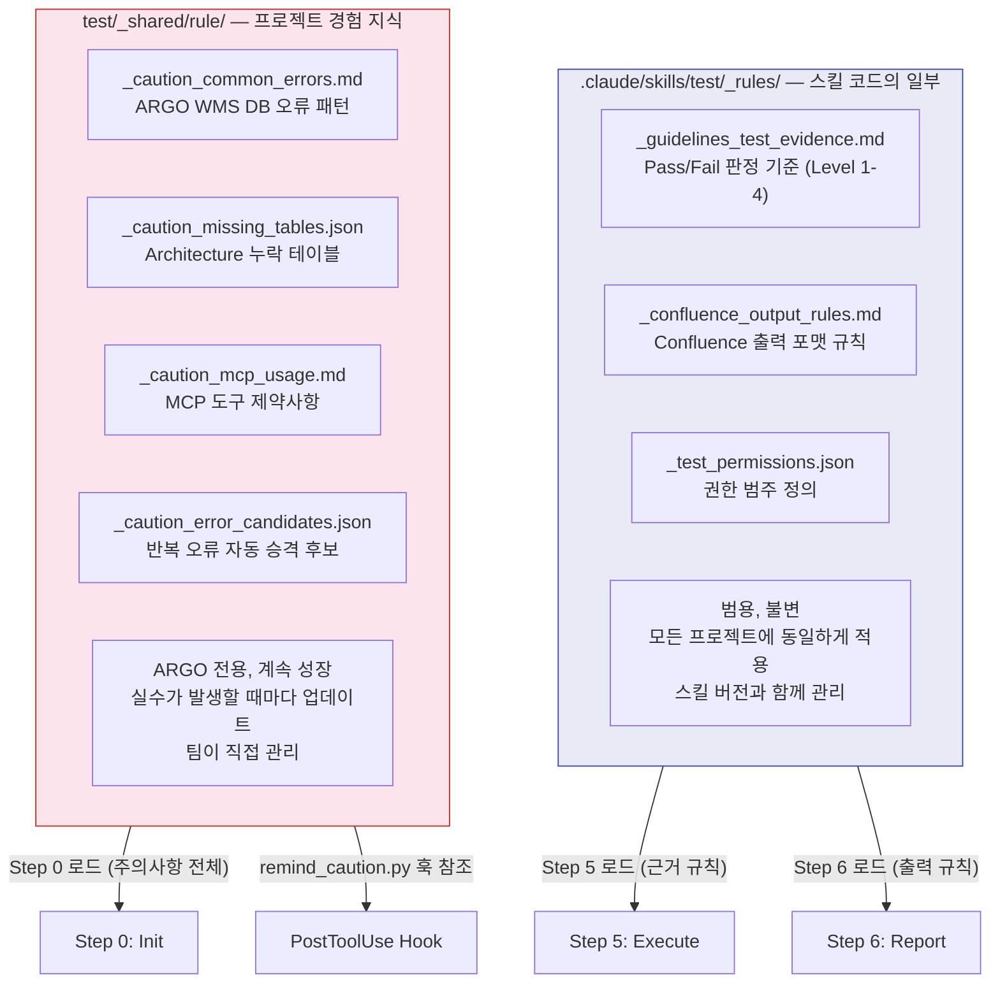

# Test Skill Suite — 아키텍처 & 설계 문서

> **Version**: v6.4 | **Updated**: 2026-02-22
>
> 이 문서는 Test Skill의 **설계 철학, 아키텍처, 실행 모델, 데이터 흐름, 파이프라인 상세**를 설명합니다.
> 사용 방법은 [../README.md](../README.md)를, 훅 시스템은 [HOOKS.md](HOOKS.md)를, 업그레이드 히스토리는 [UPGRADE_HISTORY.md](UPGRADE_HISTORY.md)를 참조하세요.

---

## 0. 전체 파이프라인 한눈에 보기


> **초록(서브에이전트)**: Task tool로 독립 실행. Main 컨텍스트를 오염시키지 않음.
> **노랑(Main Interactive)**: 사용자 의사결정이 필요하여 Main이 직접 처리.

---

---

## 1. 설계 철학

### 1.1 핵심 원칙

| 원칙 | 설명 | 적용 |
|------|------|------|
| **Single Orchestrator** | 오케스트레이터는 하나만 존재한다 | 모든 테스트 요청은 `test-run`을 통한다 |
| **Jira-First** | 테스트의 첫 단계는 항상 Jira vs 구현 비교 | `test-gate`가 Jira를 먼저 조회하고, 구현과 비교 |
| **Human Decides** | 불일치 시 어느 쪽이 정답인지는 사람이 판단 | Gate는 판단 재료만 제공 |
| **Evidence-Based** | 모든 Pass/Fail은 검증 가능한 증거 포함 | Fail 시 Level 4 근거 필수 |
| **Purpose-Aligned** | 데이터는 구조가 아니라 목적에 맞아야 한다 | 행위적 조건 검증으로 목적 부적합 데이터 사전 차단 |
| **Efficiency** | 중복 작업 최소화 | 리소스 1회 로드, 불필요 Step 자동 스킵 |
| **Traceability** | 모든 판단 근거가 파일로 남음 | 테스트시트에 jira_digest + code_digest 저장 |
| **Extensibility** | 프로젝트별 후처리를 선언적으로 확장 | `test/_post.md`로 Confluence/Jira 자동 연동 |

### 1.2 설계 결정 배경

**왜 단일 오케스트레이터인가?**

초기에는 `test-e2e`(전체 오케스트레이터)와 `test-run`(실행 오케스트레이터)이 별도로 존재했습니다.
이로 인해 Gate 2회 실행, Jira 이중 조회, Report 이중 생성 문제가 발생했습니다.
이를 `test-run` 하나로 통합하여 모든 중복을 제거했습니다.

**왜 Jira-First인가?**

코드만 분석하면 "코드가 하는 대로"가 정답이 됩니다. 코드에 버그가 있어도 "정상"으로 판정됩니다.
Jira 요구사항을 먼저 확인하고, 구현과 비교해야 진짜 버그를 잡을 수 있습니다.

**왜 행위적 조건(Behavioral Condition)이 필요한가?**

구조적으로 맞는 데이터(레코드 존재, 수량 충족)라도 코드의 조건분기를 통과하지 못하면
테스트가 의미 없는 결과를 반환합니다. 예: `if (state == PICKING)` 조건이 있는 코드를
`READY_TO_PACK` 상태 데이터로 테스트하면 항상 기본값(0)을 반환합니다.
행위적 조건은 `.claude/architecture/data-contracts.json`의 semanticContracts/dataFlowPaths를
활용하여 코드의 런타임 진입 조건을 데이터 매핑 필터로 전달합니다.

**왜 test_baseline을 시트에 저장하는가?**

다음 테스트 실행 시 "무엇이 변경되었는가"를 자동 감지하기 위함입니다.
Gate가 현재 Jira/Code와 시트에 저장된 jira_digest/code_digest를 비교하여
REUSE(재사용) / REPLAN(재생성) / NEW(신규) 판정을 자동으로 수행합니다.

---

## 2. 아키텍처

### 2.1 시스템 구조도

```mermaid
graph TD
    User([사용자 요청]) --> Run["test-run<br>(단일 오케스트레이터)"]

    subgraph "Step 0: Init"
        Run --> WsInit["test-init<br>Workspace 검증"]
        WsInit --> |READY/CREATED| Load[리소스 1회 로드<br>_shared, _templates, _caution]
        WsInit --> |NEEDS_INPUT| UserInput([사용자 입력])
        UserInput --> WsInit
        WsInit --> |NOT_READY| Stop2([중단])
    end

    subgraph "Step 1: Verify"
        Load --> RefData["참조 데이터 확인<br>(Q0: 이대로 진행?)"]
        RefData --> Gate["test-gate<br>Jira vs 구현 비교"]
        Gate --> CompareReport[불일치 리포트]
        CompareReport --> Q1{Q1: 진행?}
        Q1 -- No --> Stop([종료])
        Q1 -- Yes --> Q2{Q2: 테스트 기준?}
        Q2 --> |Jira / Code / Union| Baseline[test_baseline 확정]
    end

    subgraph "Step 2: Sheet Check"
        Baseline --> SheetCmp{기존 시트<br>baseline 비교}
        SheetCmp -- 동일 --> Reuse[REUSE: 기존 시트]
        SheetCmp -- 다름 --> Replan[REPLAN: 재생성]
        SheetCmp -- 없음 --> New[NEW: 신규 생성]
    end

    subgraph "Step 3: Plan"
        Replan & New --> Plan["test-plan<br>시트 생성"]
        Plan --> Sheet[테스트시트<br>jira_digest + code_digest 포함]
    end

    subgraph "Step 3.5: Plan Review Checkpoint (NEW/REPLAN 시)"
        Sheet --> Checkpoint{사용자 확인}
        Checkpoint -- 승인 --> Step4Start[Step 4 진행]
        Checkpoint -- 수정 요청 --> Plan
        Checkpoint -- 중단 --> Stop3([파이프라인 중단])
    end

    subgraph "Step 4: Data"
        Step4Start --> DataChk{매핑 존재?<br>버전 일치?}
        DataChk -- Yes --> SkipData[기존 매핑 사용]
        DataChk -- No --> Data["test-data<br>TC별 데이터 매핑"]
        Data --> PFC{"Purpose Fitness<br>Check (행위적 조건)"}
        PFC -- Pass --> DataOK[MAPPED 확정]
        PFC -- Fail --> NotFound["NOT_FOUND<br>→ Provisioning"]
    end

    subgraph "Step 5: Schedule & Execute"
        SkipData & DataOK & NotFound --> Sched["test-scheduler<br>Pre-flight + DAG 생성"]
        Sched --> T0["Tier 0: Provisioning<br>(test-provisioning, 병렬)"]
        T0 --> T1["Tier 1~N: Test Execution<br>(병렬)"]
        T1 --> Partial[partial_results/]
    end

    subgraph "Step 6: Report"
        Partial --> Reporter["test-reporter<br>결과 병합"]
        Reporter --> Final["Confluence_테스트결과.md"]
    end

    subgraph "Step 6.5: Review (선택적)"
        Final --> ReviewChk{TC ≥ 5 or<br>Fail ≥ 1?}
        ReviewChk -- Yes --> Review["test-review-agent<br>의미적 검증"]
        Review --> ReviewResult["{ticket}_review.json"]
        ReviewChk -- No --> Skip65([스킵])
    end

    subgraph "Step 7: Post (선택적)"
        Final --> PostChk{test/_post.md<br>존재?}
        PostChk -- Yes --> Post["test-post<br>후처리 실행"]
        Post --> Confirm{사용자 확인}
        Confirm -- Yes --> Actions["Confluence 업로드<br>Jira 코멘트 등"]
        PostChk -- No --> Skip7([스킵])
    end

    classDef orchestrator fill:#4a90d9,color:#fff
    classDef skill fill:#f5a623,color:#fff
    classDef decision fill:#7ed321,color:#fff
    classDef output fill:#9013fe,color:#fff

    class Run orchestrator
    class WsInit,RefData,Gate,Plan,Data,Sched,T0,Reporter,Post skill
    class Q1,Q2,SheetCmp,DataChk,PostChk,Confirm,Checkpoint,ReviewChk decision
    class Final,Sheet,Baseline,Actions output
```



### 2.2 스킬 컴포넌트 맵

| 스킬 | 버전 | 호출 Step | 역할 | 단독 호출 | 입력 | 출력 |
|------|------|----------|------|----------|------|------|
| **test-run** | v4.7 | — | 단일 오케스트레이터 | — | 티켓 ID | 전체 파이프라인 실행 |
| **test-init** | v1.0 | Step 0 | Workspace 검증 + 초기화 | 가능 | project_root | status |
| **test-gate** | v4.1 | Step 1 | Jira vs 구현 비교 + 서비스 탐색 + 서버 접속 확인 | 가능 | 티켓 ID, 브랜치 | test_baseline |
| **test-plan** | v2.3 | Step 3 | 영향도 분석, 시트 생성, 행위적 조건 도출 | 가능 | test_baseline | 테스트시트.md |
| **test-data** | v2.2 | Step 4 | TC별 데이터 매핑, Purpose Fitness Check | 가능 | 테스트시트 | 데이터매핑.json |
| **test-provisioning** | v1.0 | Step 5 | API 기반 데이터 생성 | 가능 | Work Unit | 생성된 엔티티 ID |
| **test-scheduler** | v1.1 | Step 5 | Pre-flight 검증 + DAG 기반 실행 계획 | 내부 | 시트 + 매핑 | execution_plan.json |
| **test-reporter** | v4.1 | Step 6 | 결과 병합, 보고서 생성 | 가능 | partial_results/ | Confluence 보고서 |
| **test-review-agent** | v1.0 | Step 6.5 | 보고서 의미적 검증 (Worker) | 가능 | 보고서 + 시트 + baseline | {ticket}_review.json |
| **test-post** | v1.0 | Step 7 | 후처리 액션 (Confluence/Jira) | 가능 | ctx + _post.md | 액션 실행 결과 |
| **test-evidence** | v1.0 | 참조 | Pass/Fail 근거 가이드 | 가능 | — | — |

### 2.3 보조 파일

| 파일 | 역할 |
|------|------|
| **SKILL.md** | 스킬 진입점 (Claude가 최초 로드하는 파일) |
| **test-workspace-conventions.md** | 디렉토리 구조, 경로 규칙, 명명 규칙 |
| **test/_post.md** | 프로젝트별 후처리 액션 정의 (Confluence 업로드, Jira 코멘트 등) |

---

## 3. 실행 모델 및 설계 개념

### 3.1 실행 주체 분류

테스트 파이프라인은 4종류의 실행 주체가 협업하는 구조입니다.

```text
┌──────────────────────────────────────────────────────────────┐
│                LLM (Claude) — Main Orchestrator               │
│                                                              │
│  Step 0 → 1 → 2 → 3 → 4 →  Step 5  → 6 → 7  (순차)        │
│                              ┌──┴──┐                         │
│                         ┌────┤ DAG ├────┐                    │
│                         │    └─────┘    │                    │
│                    [Worker 1]  ...  [Worker N]               │
│                    Task tool        Task tool                │
│                    (Subagent)       (Subagent)               │
└──────┬───────────────────────────────────┬───────────────────┘
       │ Bash tool (one-way)               │ PreToolUse Hook
       ▼                                   ▼
┌────────────────┐                ┌─────────────────────┐
│ Python Scripts │                │  Python Hook         │
│                │                │                     │
│ stimulus_      │                │ validate_test_      │
│ executor.py    │                │ result.py           │
│                │                │                     │
│ HTTP 요청 실행  │                │ Write/Edit 시       │
│ → JSON 출력    │                │ STIMULUS 증거 검증   │
│ (판단 없이)    │                │ → allow / deny      │
└────────────────┘                └─────────────────────┘

┌──────────────────────────────────────────────────────┐
│           MCP Servers (외부 시스템)                    │
│  postgres_*  → DB 조회 (Read-only)                    │
│  atlassian   → Confluence, Jira                       │
│  playwright  → 브라우저 UI 캡처                        │
└──────────────────────────────────────────────────────┘
```

| 실행 주체 | 역할 | 실행 방식 | 판단 능력 |
|----------|------|----------|----------|
| **LLM (Main)** | 파이프라인 오케스트레이션, 의사결정 | 직접 실행 | 있음 (판단/설계) |
| **LLM (Worker)** | TC 실행, Provisioning, 문서 작성 | Task tool Subagent | 있음 (위임된 범위 내) |
| **Python Script** | HTTP 요청 실행, 증거 검증, 데이터 집계/비교 | Bash tool / Hook | 없음 (결정론적) |
| **MCP Server** | DB 조회, 외부 API 호출 | MCP tool call | 없음 (쿼리 실행만) |

### 3.2 통신 모델

각 실행 주체 간 통신은 **단방향(one-way)** 또는 **게이트(gate)** 패턴입니다.

```text
LLM (Main)
  ├─→ Python (stimulus_executor.py)     ONE-WAY
  │     LLM이 파라미터 결정 → Python이 기계적 실행 → 파일 출력
  │
  ├─→ Python (validate_test_result.py)  GATE
  │     Hook이 Write/Edit 시 자동 실행
  │     STIMULUS 증거 있으면 allow, 없으면 deny
  │
  ├─→ Python (토큰 최적화 도구 5종)     ONE-WAY
  │     summarize_partial_results.py  — partial_results → 요약 JSON
  │     compare_db_snapshots.py       — before/after → diff JSON
  │     generate_mermaid_diagrams.py  — 요약 → Mermaid 코드 골격
  │     generate_mermaid_urls.py      — Mermaid 다이어그램 → 렌더링 URL
  │     validate_report_structure.py  — Confluence 문서 → 체크리스트
  │
  ├─→ LLM (Worker Subagent)             SPAWN + RESULT
  │     Task tool로 생성 → 완료 시 결과 메시지 반환
  │     실행 중 Main과 통신 불가 (독립 실행)
  │
  └─→ MCP Server                        REQUEST / RESPONSE
        Tool call → 즉시 결과 반환 (동기)
```

> **설계 의도**: Python 스크립트에 "판단"을 맡기지 않습니다. HTTP 요청의 파라미터는 LLM이 결정하고, Python은 기계적으로 실행합니다. LLM이 API 응답을 조작/왜곡하는 것을 구조적으로 방지합니다.

### 3.3 파이프라인 실행 모델

#### 전체: 순차 (Sequential)

```text
Step 0 ──→ Step 1 ──→ Step 2 ──→ Step 3 ──→ 3.5 ──→ Step 4 ──→ Step 5 ──→ Step 6 ──→ 6.5 ──→ Step 7
(Init)    (Verify)   (Sheet)   (Plan)   (Chkpt) (Data)    (Execute) (Report) (Review)  (Post)
```

#### Step 5 내부: DAG 기반 병렬 (Tiered Parallelism)

```text
                    test-scheduler가 DAG 생성
                            │
                ┌───────────┼───────────┐
                ▼           ▼           ▼
Tier 0:    [PROV_A]    [PROV_B]    [PROV_C]     ← 독립 Provisioning 병렬
                │           │           │
                └─────┬─────┘───────────┘
                      │ Strict Join (모두 완료 대기)
                      ▼
Tier 1:    [PROV_Z depends_on A,B,C]             ← 의존성 해소 후 실행
                      │
                      │ Strict Join
                      ▼
Tier 2:    [TC-1.1]  [TC-1.2]  [TC-2.1]         ← 독립 TC 병렬 실행
                         │
                    partial_results/
```

**병렬 실행의 실체**: LLM이 여러 Task tool Worker를 동시에 생성합니다. 각 Worker는 독립된 LLM 인스턴스(Subagent)로, API 호출 수준에서 병렬입니다.

### 3.4 DAG 스케줄링 구현

#### 구현 방식: LLM이 알고리즘을 "실행"

`test-scheduler.md`에 Python pseudo-code(`build_dag()`, `schedule_tiers()`)가 정의되어 있습니다.
LLM이 알고리즘을 이해하고 테스트시트+데이터매핑을 분석하여 `execution_plan.json`을 직접 출력합니다.
실제 Python DAG 라이브러리(networkx, airflow)를 사용하지 않습니다.

#### DAG 규칙

| 규칙 | 설명 | 보장 |
|------|------|------|
| **Branch Independence** | 다른 Parent의 브랜치는 항상 병렬 | 데이터 간섭 방지 |
| **Atomic Sequence** | 엔티티 생성 내부(a→b→c)는 단일 Worker | 원자성 보장 |
| **Strict Join** | Tier 내 모든 Task SUCCESS 후 다음 Tier | 의존성 보장 |
| **Recursive Spawning** | 동일 엔티티 N개 → N개 독립 노드 | 병렬 효율 |
| **Cycle Detection** | indegree(0) 노드 없으면 순환 오류 | 무한루프 방지 |

### 3.5 상태 관리 — Write-Through + Read-Through Cache

파이프라인의 상태는 **2계층 캐시 구조**로 관리됩니다.

```text
L1: ctx 객체 (LLM 메모리)  — 빠름, 휘발성 (컨텍스트 압축 시 유실 가능)
L2: 파일 (디스크)           — 느림, 영구 (세션 종료 후에도 유지)
```

#### Write-Through (쓰기 전략)

각 Step 완료 시 결과를 **ctx와 파일에 동시 저장**합니다.

```text
Step 완료 → ctx.{field} = 결과값
         → Write({ticket_folder}/{파일}) = 동일 결과값
```

#### Read-Through Fallback (읽기 전략)

각 Step 시작 시 필요한 ctx 필드가 없으면 **파일에서 복원**합니다.

```text
Step 시작 → ctx.{field} 존재?
             ├─ YES → 사용 (L1 히트)
             └─ NO  → 파일에서 복원 시도 (L2 폴백)
                       ├─ 파일 존재 → ctx.{field} = parse(파일)
                       └─ 파일 없음 → ERROR: "선행 Step 미완료" → 중단
```

#### 복원 맵 (ctx 필드 → 파일)

| ctx 필드 | 복원 파일 | 복원 방법 |
|----------|----------|----------|
| test_baseline | `{ticket}_gate_{latest}.json` | Glob → 타임스탬프 최신 → JSON parse |
| sheet | `{ticket}_테스트시트_v*.md` | Glob → 최고 v{N} 선택 |
| data_mapping | `{ticket}_데이터매핑.json` | Read → JSON parse |
| execution_plan | `{ticket}_execution_plan.json` | Read → JSON parse |
| partial_results | `partial_results/*.json` | Glob → 경로 목록 |
| confluence_file | `{ticket}_Confluence_테스트결과_v*.md` | Glob → 최신 버전 |
| behavioral_gate | `{ticket}_behavioral_gate.json` | Read → JSON parse |
| tc_spec | `{ticket}_tc_spec.json` | Read → JSON parse |
| report_result | `partial_results/_summary.json` | Read → JSON parse |
| server_env_map | (ctx.test_baseline에서 파생) | test_baseline 복원 후 → ctx.server_env_map = ctx.test_baseline.server_env_map |
| auth_url | `test/_shared/환경/API_엔드포인트.md` | Read → AUTH_URL 추출 |

> **ctx.ticket, ctx.ticket_folder**: 파일에서 복원 불가. 유실 시 사용자에게 재질문.
> **ctx.auth_body**: 파일 저장 금지 (보안). 컨텍스트 압축 후에는 `test/_shared/환경/계정.md`에서 loginId/password 재추출 후 json.dumps()로 재생성.

#### Step 간 상태 전달 방법

| 구간 | 방법 | 이유 |
|------|------|------|
| Main → Main (Step 간) | B (ctx) + Recovery | ctx로 빠르게 전달, 유실 시 파일에서 복원 |
| Main → Worker (Step 5) | A (프롬프트 임베딩) | Worker는 독립 LLM이므로 ctx 공유 불가 |
| Worker → Main (결과) | 파일 기반 | Worker가 partial_results/에 쓰고, Main이 Glob으로 수집 |

### 3.6 Worker 간 격리

| 항목 | 격리 여부 | 상세 |
|------|----------|------|
| 메모리 (ctx) | 격리됨 | 각 Worker는 독립 LLM 인스턴스 |
| 파일 읽기 | 공유 가능 | read-only이므로 안전 |
| 파일 쓰기 | 충돌 가능 | TC별 독립 파일로 방지 |
| DB 조회 | 공유 가능 | Read-only MCP |
| API 호출 | 독립 | 각 Worker 독립 실행 |

**충돌 방지**: 각 Worker는 고유한 `partial_results/{TC_ID}.json`에 결과 저장.
데이터매핑.json 업데이트는 Tier 완료 후 순차 처리.

### 3.7 설계 결정 및 트레이드오프

#### LLM + Python 하이브리드 채택 이유

| 대안 | 채택하지 않은 이유 |
|------|-------------------|
| Python 스크립트 오케스트레이터 | 시나리오 해석, 증거 판단, 자연어 보고서 생성 불가 |
| 외부 테스트 프레임워크 (pytest) | 동적 테스트 계획, Jira 연동에 부적합 |
| **LLM + Python 하이브리드** | **현재 채택** — LLM이 판단, Python이 실행 |

#### Python ↔ LLM 경계선 원칙

```text
✅ Python이 하는 것 (정형화):
  - HTTP 요청 실행, JSON 파싱/집계
  - 숫자 카운트, 문자열 비교
  - 파일 존재 확인, Mermaid 템플릿 생성
  - 보고서 구조 체크리스트 검증

❌ Python이 하지 않는 것 (유동적):
  - PASS/FAIL 판정 (verdict)
  - 자연어 근거/해석 작성
  - "이 변경이 정상인가?" 판단
  - Fail 시 근본 원인 분석
```

LLM은 항상 Python 출력의 최종 판단 권한을 가집니다.

#### Python DAG 라이브러리를 쓰지 않는 이유

| 관점 | 현재 (LLM 해석) | 대안 (Python 라이브러리) |
|------|----------------|----------------------|
| **유연성** | 높음 — 시트 형식 변경에 즉시 대응 | 낮음 — 파서 코드 수정 필요 |
| **정확성** | 중간 — LLM이 실수할 수 있음 | 높음 — 결정론적 |
| **복잡성 한계** | 10~20 TC | 수백~수천 노드 |
| **유지보수** | 스킬 문서 수정만 | 코드 배포 필요 |

> TC 수가 50개 이상으로 증가하면 Python DAG 라이브러리 도입 검토 필요.

### 3.8 주의사항 및 한계

#### LLM 오케스트레이션의 한계

| 한계 | 완화 방법 |
|------|----------|
| DAG 실수 가능 (의존성 누락) | 사용자가 execution_plan.json 검토 |
| 컨텍스트 윈도우 한계 (TC 50+) | partial_results/ 파일 기반 저장 |
| 세션 중단 시 ctx 유실 | 파일 기반 Auto-Skip으로 재개 |
| 비결정론적 실행 | 핵심 판단은 사용자 확인 (Q1, Q2) |

#### Worker 병렬 실행의 한계

| 한계 | 완화 방법 |
|------|----------|
| 동시 실행 수 제한 | Tier 단위 배치 |
| 파일 쓰기 충돌 | TC별 독립 파일 |
| 롤백 미지원 | 개별 실패 처리 |
| Worker 간 통신 불가 | 파일 기반 결과 전달 |

#### 확장 시 고려사항

```text
현재 적합한 규모:
  - TC 수: 5~20개
  - 병렬 Worker: 3~5개
  - DAG 깊이: 2~3 Tier

확장 시 검토 필요:
  - TC 수 50+ → Python DAG 라이브러리 도입
  - Worker 10+ → 큐잉 메커니즘 필요
  - CI/CD 통합 → Python CLI wrapper 도입
```

### 3.9 메타데이터 토큰 예산

| 카테고리 | ~토큰 | 용도 |
|----------|-------|------|
| Core (services, manifest) | 5.4K | 서비스 목록, 메타데이터 상태 |
| API Dependencies | 10.4K | 서비스 간 API 호출 관계 |
| Data Contracts | 15.6K | ID 매핑, Null 시맨틱스, 의미적 계약 |
| Kafka Topics | 26.9K | 토픽 + Producer/Consumer 매핑 |
| DB Schemas | 44.9K | 서비스별 DB 테이블/컬럼 구조 |
| Message Schemas | 25.9K | Kafka 메시지 DTO 구조 |
| **전체 로드 시** | **~129K** | — |

`analysis_mode`에 따라 선택적 로드:

| analysis_mode | ~토큰 | 조건 |
|---------------|-------|------|
| METADATA | 25~45K | 단일 서비스 테스트 |
| HYBRID | 35~55K | 일부 메타데이터 outdated |
| SOURCE_DIRECT | 50~100K | 메타데이터 없음 (소스 직접 탐색) |

---

## 4. 디렉토리 구조

```text
<project-root>/
│
├── test/                                  ← 프로젝트별 리소스 + 출력
│   ├── _shared/                           ← 공유 환경/도메인 지식 (읽기 전용)
│   │   ├── 환경/
│   │   │   ├── URL.md
│   │   │   ├── 실행_규칙.md
│   │   │   ├── 계정.md
│   │   │   └── API_엔드포인트.md
│   │   └── 도메인/
│   │       └── {도메인명}.md
│   ├── _post.md                           ← (선택) 후처리 액션 정의
│   ├── _templates/                        ← 템플릿 (읽기 전용)
│   ├── _shared/rule/                      ← 실행 규칙 (에러 방지, 근거, 출력)
│   │   ├── _caution_missing_tables.json
│   │   ├── _caution_common_errors.md      ← remind_caution.py 키워드 소스
│   │   ├── _caution_mcp_usage.md
│   │   ├── _guidelines_test_evidence.md
│   │   └── _confluence_output_rules.md
│   │
│   └── {티켓}_{기능명}/                   ← 기능별 출력 폴더
│       ├── {티켓}_테스트시트_v{N}_{날짜}.md
│       ├── {티켓}_데이터매핑.json
│       ├── {티켓}_Confluence_테스트결과_v{N.M}_{날짜}.md
│       └── partial_results/
│           └── *.json
│
├── .claude/
│   └── skills/test/                       ← 스킬 정의
│       ├── SKILL.md                       ← 진입점
│       ├── README.md                      ← 사용 가이드
│       ├── doc/                           ← 설계 문서
│       │   ├── ARCHITECTURE.md           ← 이 문서
│       │   ├── HOOKS.md                   ← 훅 시스템 문서
│       │   └── UPGRADE_HISTORY.md         ← 업그레이드 히스토리
│       ├── test-run.md                    ← 오케스트레이터
│       ├── test-init.md                   ← Workspace 초기화
│       ├── test-gate.md                   ← Jira vs 구현 비교
│       ├── test-plan.md                   ← 테스트시트 생성
│       ├── test-data.md                   ← TC별 데이터 매핑
│       ├── test-provisioning.md           ← API 기반 데이터 생성
│       ├── test-scheduler.md              ← DAG 기반 실행 계획
│       ├── test-reporter.md               ← 결과 보고서 생성
│       ├── test-post.md                   ← 후처리 액션
│       ├── test-evidence.md               ← Pass/Fail 근거 가이드
│       ├── test-workspace-conventions.md  ← 경로/명명 규칙
│       └── tools/                         ← 훅 및 도구 스크립트
│           ├── validate_test_result.py
│           ├── validate_test_sheet.py
│           ├── validate_data_mapping.py
│           ├── behavioral_gate.py
│           ├── remind_caution.py
│           ├── stimulus_executor.py
│           ├── verdict_calculator.py
│           ├── compare_db_snapshots.py
│           ├── summarize_partial_results.py
│           ├── generate_mermaid_diagrams.py
│           ├── generate_mermaid_urls.py
│           └── validate_report_structure.py
│
└── .claude/architecture/                  ← 참조 메타데이터 (선택)
    ├── services.json
    ├── api-dependencies.json
    ├── kafka-topics.json
    ├── data-contracts.json
    └── db-schemas/
```

### _ (underscore) 접두사 규칙

- **`_` 폴더** (`_shared/`, `_templates/`): 규칙/설정 영역. 테스트 출력 금지.
- **`_` 파일** (`_caution_*`, `_guidelines_*`): 실행 전 필수 로드 문서.

---

## 4.5 폴더 역할 — `_rules/` vs `_shared/rule/`

이름이 비슷해 보이지만 성격이 완전히 다릅니다.



| 구분 | `.claude/skills/test/_rules/` | `test/_shared/rule/` |
|------|-------------------------------|---------------------|
| **한 줄 요약** | "어떻게 테스트해야 하는가" | "이 프로젝트에서 조심할 것들" |
| **소유자** | 스킬 개발자 | 테스트 팀 (ARGO) |
| **이식성** | 다른 프로젝트 그대로 사용 가능 | ARGO에만 의미 있음 |
| **생명주기** | 스킬 버전과 함께 관리 | 실수 발생 시 축적 |
| **비유** | 교과서 | 현장 메모장 |

---

## 5. 데이터 흐름 (Context Model)

파이프라인 전체에서 `ctx` 객체가 Step 간 데이터를 전달합니다:

```text
Step 0 (Init)
  → ctx.init_status = READY | CREATED | NEEDS_INPUT | NOT_READY

Step 1 (Gate v4.1)
  → ctx.analysis_mode    = METADATA | HYBRID | SOURCE_DIRECT
  → ctx.test_baseline    = { mode, baseline_mode, jira_digest, code_digest, comparison, test_scope }
  → ctx.affected_services= [{ repo, type(BE_API/FE_WEB/FE_APP), branch, commits }]
  → ctx.test_types       = { api_test, db_verify, web_ui_capture, mobile_api_simulation, event_verify }
  → ctx.server_env_map   = 서비스별 환경(env)/URL 매핑 (test-gate 출력)

Step 2 (Sheet Check)
  → ctx.sheet        = 기존 시트 경로 (REUSE) 또는 null
  → ctx.sheet_action = REUSE | REPLAN | NEW

Step 3 (Plan)
  → ctx.sheet         = 생성된 시트 경로
  → ctx.sheet_version = "v{N}"

Step 4 (Data)
  → ctx.data_mapping = { mappings: [...], summary: { mapped, not_found, ... } }

Step 5 (Execute)
  → ctx.execution_plan  = test_execution_plan.json
  → ctx.partial_results = partial_results/*.json 경로 목록

Step 6 (Report)
  → ctx.confluence_file = Confluence 파일 경로
  → ctx.report_result   = { result, pass_count, fail_count, total_count }

Step 7 (Post)
  → post_actions_result = 각 액션 실행 결과 (성공/실패/스킵)
```

### 핵심 데이터 구조

#### test_baseline (Gate 출력)

```json
{
  "ticket": "PROJ-123",
  "branch": "feature/PROJ-123-feature-description",
  "mode": "REPLAN | REUSE | NEW",
  "baseline_mode": "jira | code | union | match",
  "jira_digest": [
    { "id": "J1", "content": "요구사항 내용", "source": "description | acceptance_criteria | subtask" }
  ],
  "code_digest": [
    { "id": "C1", "content": "구현 내용", "files": ["변경파일.java"] }
  ],
  "comparison": {
    "matched": [["J1","C1"]],
    "jira_only": ["J3"],
    "code_only": ["C4"]
  },
  "test_scope": ["J1/C1", "J3", "C4"]
}
```

#### 데이터매핑.json (Data 출력)

```json
{
  "ticket": "PROJ-123",
  "sheet_version": "v2",
  "mappings": {
    "TC-1.1": {
      "status": "MAPPED | NOT_FOUND | PROVISIONING_NEEDED | PROVISIONED",
      "data": { "entity_code": "ENT-00001", "partition_id": 1001 },
      "behavioral_check": {
        "verdict": "PASS",
        "conditions": ["outbound_order.state = READY"],
        "method": "DB 직접 조회"
      }
    }
  },
  "summary": { "total_tcs": 15, "mapped": 11, "not_found": 3 }
}
```

---

## 6. 파이프라인 상세

각 Step의 내부 동작 상세입니다.

### Step 0: Init — Workspace 검증 + 리소스 로드

#### 0.1 Workspace 초기화 (`test-init`)

| 검증 항목 | 없을 때 행동 |
|----------|-------------|
| `test/` 폴더 구조 | 필수 폴더 자동 생성 |
| 보일러플레이트 파일 | 표준 내용으로 자동 생성 |
| 스캐폴드 파일 (환경, 계정, API) | `{TODO}` 포함 템플릿 생성 → 사용자 입력 요청 |
| 포인터 파일 | `test/_shared/rule/` 원본 참조 파일 생성 |

**Init 판정 결과:**

| Status | 다음 행동 |
|--------|----------|
| `READY` | 즉시 리소스 로딩 |
| `CREATED` | 알림 후 진행 |
| `NEEDS_INPUT` | 사용자 입력 후 재검증 |
| `NOT_READY` | 파이프라인 중단 |

#### 0.2 리소스 1회 로드

```text
[1단계] 공통 환경 + 도메인 (test/_shared/)
[2단계] 템플릿 (test/_templates/)
[3단계] 에러 방지 (test/_shared/rule/)
  → _caution_missing_tables.json, _caution_common_errors.md, _caution_mcp_usage.md
[4단계] 근거/출력 규칙
  → _guidelines_test_evidence.md, _confluence_output_rules.md
```

전체 파이프라인에서 **1회만** 로드. 이후 Step에서 재로드하지 않음.

---

### Step 1: Verify — test-gate v4.1

Gate는 테스트의 **첫 번째이자 가장 중요한 단계**입니다. 3가지 원칙:

1. **사람이 판단한다** — Jira와 구현이 다를 때 Gate는 판단 재료만 제공
2. **서버 없으면 중단** — BE API 서버 접속 실패 시 즉시 중단. DB만으로 대체 불가
3. **모바일은 API 시뮬레이션** — 모바일 소스에서 API 흐름 추출 → BE API 직접 호출

**Gate 흐름:**
```
참조 데이터 확인 → Jira 수집 → 코드 분석 → 비교 리포트 → 사용자 의사결정
→ 서비스 탐색 → 범위 판단 → 서버 접속 확인 (❌ 실패 → 중단!) → baseline 확정
```

**Gate 출력 (`test_baseline`):**

| 필드 | 설명 |
|------|------|
| mode | NEW / REUSE / REPLAN |
| baseline_mode | match / jira / code / union |
| jira_digest, code_digest | Jira/Code 정규화 항목 |
| affected_services | 탐색된 서비스 (repo, type, branch) |
| test_types | api_test, db_verify, web_ui_capture, mobile_api_simulation, event_verify |
| server_connectivity | 각 서버 접속 결과 |

**analysis_mode:** `METADATA` (메타데이터 전부 존재) / `HYBRID` (일부) / `SOURCE_DIRECT` (없음)

---

### Step 2: Sheet Check — 시트 버전 자동 판정

| 조건 | 판정 | 다음 |
|------|------|------|
| 시트 없음 | `NEW` | Step 3 진행 |
| 시트 있음 + baseline 다름 | `REPLAN` | Step 3 진행 (v{N+1}) |
| 시트 있음 + baseline 동일 | `REUSE` | Step 3 **스킵** |

판정 기준: 기존 시트의 `Section 0`에 저장된 `jira_digest` + `code_digest`와 현재 Gate 결과를 **의미적으로** 비교.

---

### Step 3: Plan — 테스트시트 생성 (`test-plan`)

- Jira를 **재조회하지 않음** (Gate 결과 사용)
- 시트 Section 0에 `jira_digest` + `code_digest` 저장 (다음 Gate 비교용)
- 4-Layer 영향도 분석: **Logic** / **API** / **DB** / **Event(Kafka)**
- TC별 사전조건 및 데이터 요구사항 명시

**기대결과 도출 원칙:**
```
✅ 올바른 흐름:  Jira 요구사항 → 기대결과 도출 → 코드 분석으로 검증 방법 결정
❌ 잘못된 흐름:  코드 분석 → 코드 동작을 기대결과로 설정 → Jira 무시
```

**시트 구조:**
```
## 0. Test Baseline          ← Gate 비교용 저장 (필수!)
## 1. 변경 요약
## 2. 영향도 분석
## 3. 테스트 시나리오 목록
## 4. 시나리오 상세
## 5. 변경 이력
```

---

### Step 3.5: Plan Review Checkpoint (NEW/REPLAN 시 신규)

테스트시트 생성 완료 후 사용자에게 요약을 제시하고 확인을 받습니다.

**제시 내용:**
- TC 개수 (ACTIVE vs OBSERVATION)
- 시나리오 목록 (1줄 요약)
- 예상 데이터 요구사항
- STIMULUS 명세 유무 현황

**선택지:**
1. **승인** → Step 4 진행
2. **수정 요청** → 피드백 반영 후 재생성 (Step 3 재실행)
3. **중단** → 파이프라인 중단 (시트는 저장됨)

> REUSE 시 이 Checkpoint 스킵 (기존 시트 그대로 사용).

---

### Step 4: Data — TC별 데이터 매핑 (`test-data`)

| 조건 | 동작 |
|------|------|
| 매핑 파일 존재 + 시트 버전 일치 | **스킵** |
| 매핑 파일 없음 또는 버전 불일치 | DB 크로스 워크플레이스 검색 |
| NOT_FOUND 발생 | 사용자에게 Provisioning 제안 |

**크로스 파티션 검색**: partition_id를 고정하지 않고 모든 파티션에서 검색.
동일 파티션에서 여러 TC를 커버할 수 있는 데이터를 우선 선택.

**NOT_FOUND 시 사용자 선택지:**
```
[1] 계속 진행 → NOT_FOUND TC는 N/T (Not Tested) 처리
[2] Provisioning 모드 → test-provisioning이 API로 데이터 생성
[3] 중단 → 사용자가 수동으로 데이터 준비 후 재실행
```

---

### Step 5: Schedule & Execute — DAG 기반 병렬 실행

#### 5.1 Scheduling (`test-scheduler`)

```text
test-scheduler → DAG 생성
  ├─ Tier 0: Provisioning (병렬)
  ├─ Tier 1~N: Test Execution (병렬, 의존성 해소 순)
  └─ Tier N+1: Post-Verification (사이드이펙트 검증)
```

#### 5.2 Execution (Tiered Loop)

```text
FOR each Tier:
  - 현재 Tier의 parallel_tasks 동시 실행
  - PROVISION → test-provisioning Worker 호출
  - TEST      → 실제 테스트 로직 (API 호출 + DB 검증)
  - Strict Sync: 현재 Tier 완료 후 다음 Tier
  - 각 Task 결과 → partial_results/*.json
```

#### 5.3 Provisioning (`test-provisioning`)

Worker Subagent로서 엔티티 생성 단위 작업을 원자적으로 실행:
1. API 시퀀스 결정 (api-dependencies.json 참조)
2. 인증 처리 (테스트 계정 → 토큰 확보)
3. API 체인 실행 (주문 생성 → 배치 생성 → Job 생성)
4. 매핑 파일 업데이트 (status → PROVISIONED)

**안전 규칙**: DB 직접 INSERT 금지, API 경유 필수, 운영 환경 차단.

---

### Step 6: Report — 최종 보고서 생성 (`test-reporter`)

`partial_results/*.json`을 수집하여 단일 Confluence 문서로 병합.

**Template Compliance Check (필수 포함):**
- [ ] 용어 정의
- [ ] API 응답 필드 안내
- [ ] 코드 수정 요약 (Before/After + 효과 요약)
- [ ] 테스트 흐름 (Mermaid)
- [ ] 사전 조건 DB 검증
- [ ] TC 상세 (Pass/Fail Evidence)
- [ ] 전체 결과 요약

---

### Step 6.5: Review — 보고서 의미적 검증 (선택적, 신규)

`test-review-agent`를 Worker로 호출하여 보고서를 의미적으로 검증합니다.

**스킵 조건**: TC 4개 이하 AND Fail 0개인 소규모 테스트

**검증 항목:**
- **커버리지**: test_scope의 모든 항목이 TC로 커버되었는가?
- **근거 품질**: Fail TC는 Level 4인가? Pass TC에 diff 테이블이 있는가?
- **논리 일관성**: 도출 트리 ④ 기대값과 VERDICT가 일치하는가?
- **누락 검증**: 영향도 분석(Section 2)의 사이드이펙트가 모두 TC화되었는가?

**출력 (`{ticket}_review.json`):**
```json
{
  "verdict": "APPROVED | NEEDS_REVISION",
  "issues": [
    { "severity": "critical | important | minor", "tc_id": "TC-1.1", "issue": "..." }
  ]
}
```

**후속 처리:**
- `APPROVED` → Step 7 진행
- `NEEDS_REVISION` (critical) → 사용자에게 보고 + 수정 여부 질문
- `NEEDS_REVISION` (important/minor만) → 이슈 보고 후 계속 진행

---

### Step 7: Post — 후처리 액션 (`test-post`)

`test/_post.md`가 있으면 실행, 없으면 스킵 (Convention over Configuration).

**지원 액션:**

| 액션 | 설명 |
|------|------|
| `confluence-upload` | Confluence 페이지 생성/업데이트 |
| `jira-comment` | Jira 티켓에 코멘트 추가 |
| `custom` | 사용자 정의 메시지 출력 |

**`_post.md` 작성 예시:**
```markdown
## confluence-upload
- source: confluence
- space: WMS
- parent: QA 테스트 결과
- title: [{ticket}] {summary} 테스트결과 {version}
- mode: create_or_update

## jira-comment
- condition: {result} == PASS
- content: |
    테스트 완료: {result} ({pass_count}/{total_count})
```

**사용 가능한 변수:** `{ticket}`, `{summary}`, `{version}`, `{date}`, `{result}`, `{pass_count}`, `{fail_count}`, `{total_count}`, `{branch}`, `{confluence_file}`, `{sheet_file}`

---

## 7. 변경 이력

| 버전 | 날짜 | 변경 내용 |
|------|------|----------|
| v6.4 | 2026-02-22 | ARCHITECTURE.md 분리 신규 생성. Step 3.5 Checkpoint, Step 6.5 Review, 훅 시스템(doc/HOOKS.md) 반영 |
| v6.3 | 2026-02-21 | 상태 관리 확장: Write-Through + Read-Through Cache, 복원 맵, A/B 방법 분류 |
| v6.2 | 2026-02-20 | 메타데이터 토큰 예산 추가 |
| v6.1 | 2026-02-20 | 실행 모델 및 설계 개념 섹션 추가 |
| v6.0 | 2026-02-20 | Step 7 (Post) 추가, test-reporter v3.0 반영 |
| v5.0 | 2026-02-14 | Gate v4.0 반영 (서비스 탐색, 서버 접속, 모바일 시뮬레이션) |
