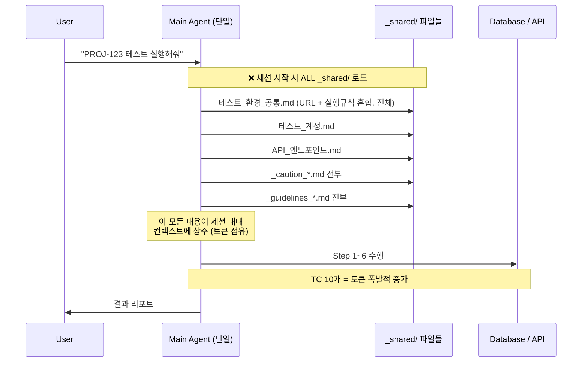
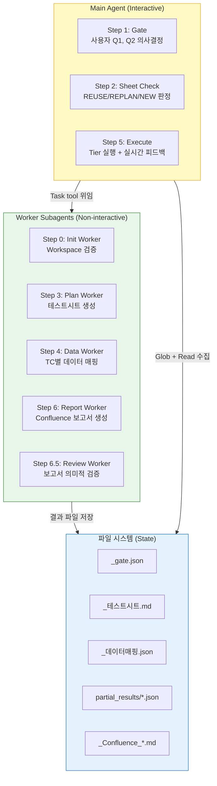
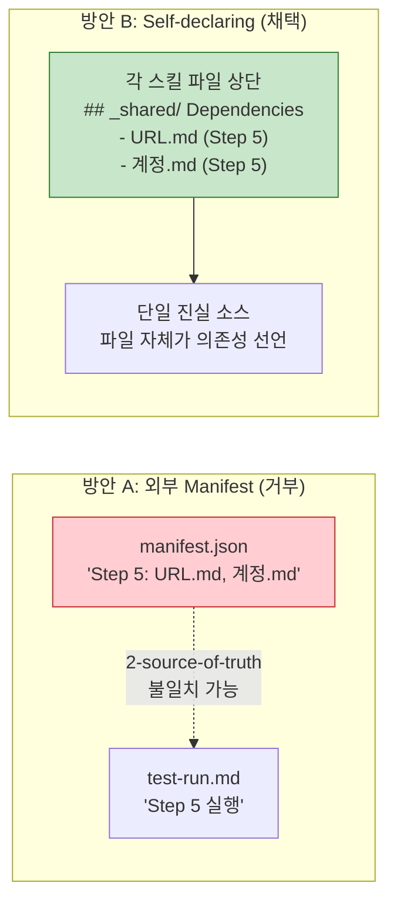
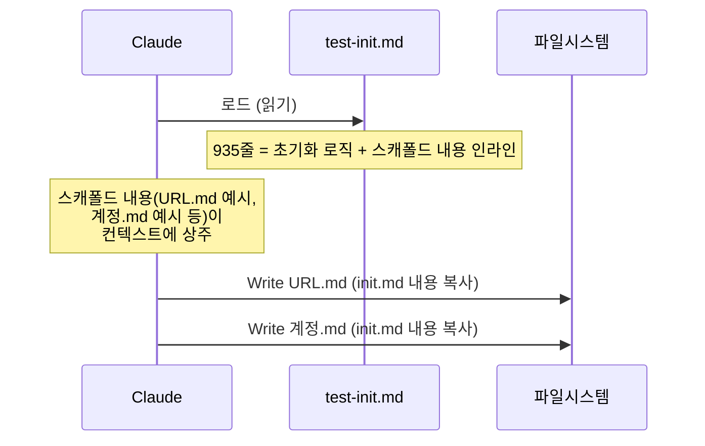
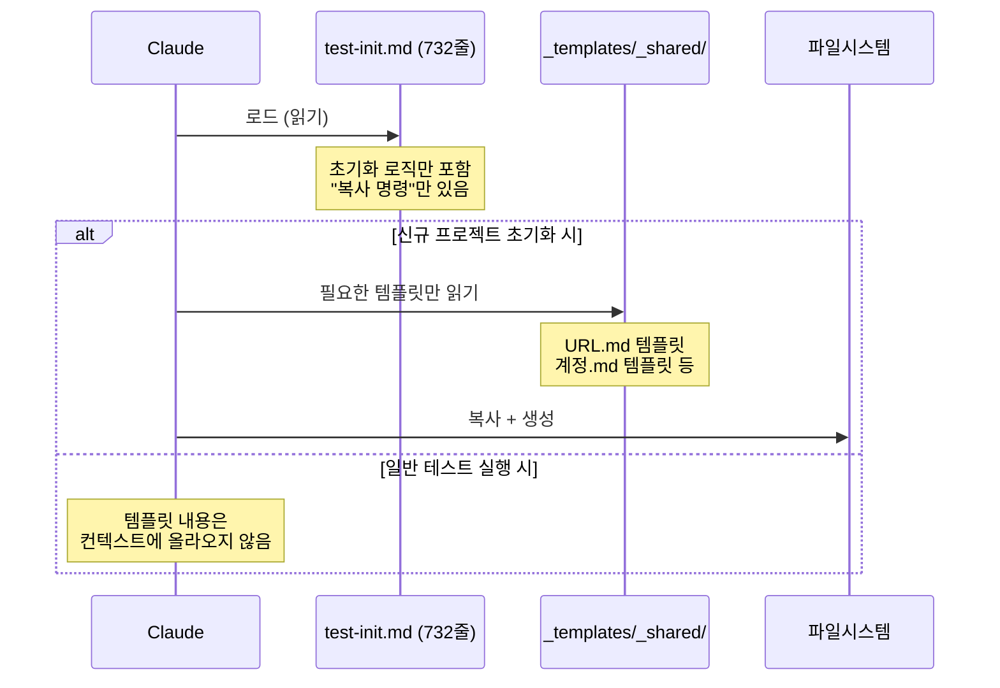
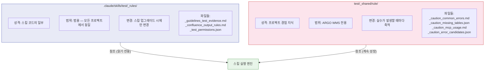
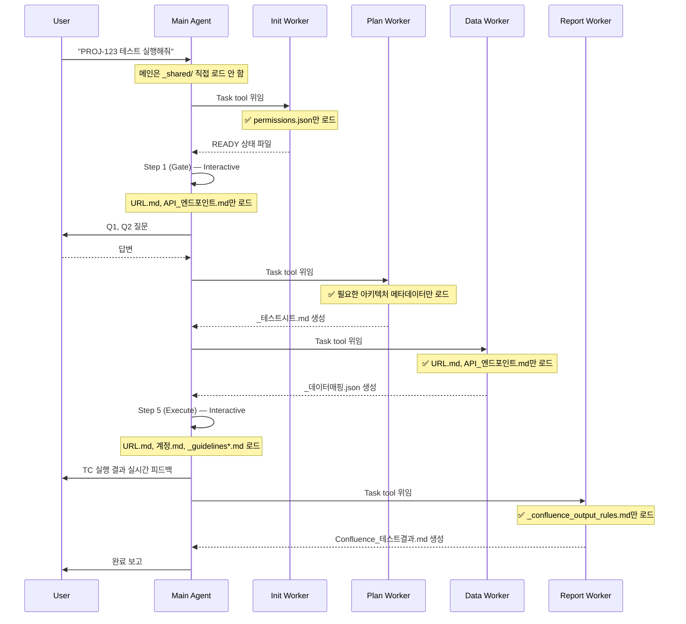
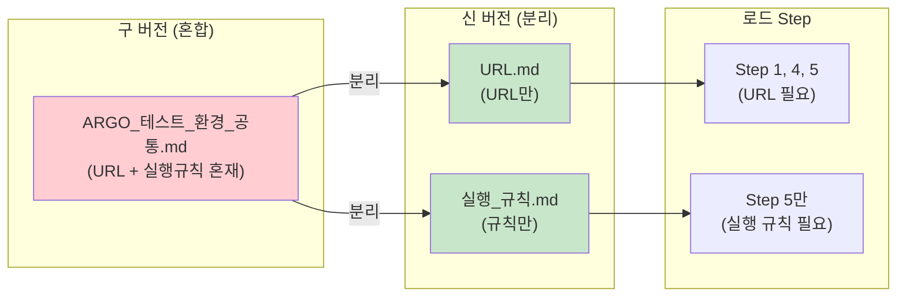
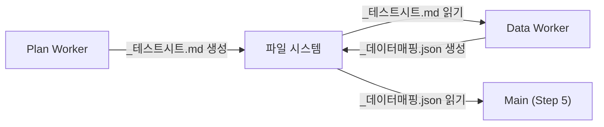
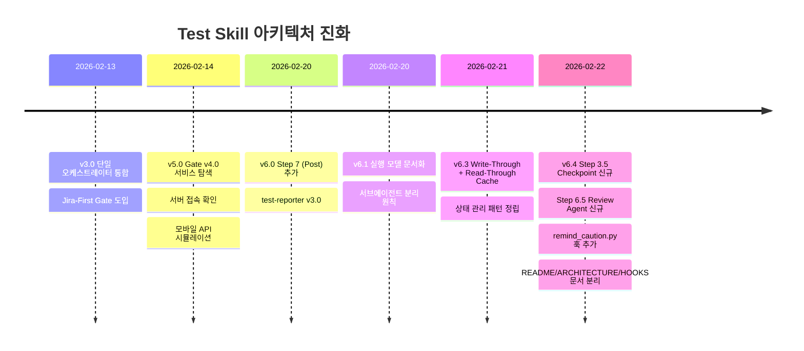

# Test Skill Suite — 업그레이드 히스토리

> **대상 독자**: 테스트 스킬을 처음 접하거나, 왜 이런 구조가 됐는지 궁금한 분들
> **목적**: 아키텍처 결정의 배경과 진화 과정을 교육용으로 설명

---

## 1. 업그레이드 배경 — 왜 바꿨나?

### 1.1 원래의 문제들

#### 문제 1: 세션 시작 시 `_shared/` 전체 로드

메인 에이전트가 세션 시작 시 `_shared/` 폴더의 모든 파일을 한꺼번에 읽어서 컨텍스트에 올렸습니다. 이 내용은 세션이 끝날 때까지 컨텍스트를 점유하며, TC가 10개만 돼도 토큰이 폭발적으로 늘어났습니다.

#### 문제 2: 스캐폴드 템플릿이 init.md 안에 인라인

`test-init.md`가 신규 프로젝트 초기화 시 생성할 파일의 내용을 **직접 포함**하고 있었습니다. 초기화와 무관한 테스트 실행 시에도 이 내용이 토큰을 소모했습니다.

#### 문제 3: 파일명 혼란

`테스트_환경_공통.md` 하나에 서버 URL과 실행 규칙이 함께 들어 있었습니다. URL이 필요한 Step(1, 4, 5)과 실행 규칙이 필요한 Step(5)이 달라서 필요한 것만 로드하는 최적화가 불가능했습니다.

#### 문제 4: `_rules/` vs `_shared/rule/` 역할 불명확

두 폴더 모두 "규칙"을 담고 있어서, 어디에 무엇을 넣어야 하는지 혼란이 있었습니다.

---

### 1.2 Before 아키텍처 — 문제점 시각화

**핵심 문제**: "나중에 필요할 것 같아서" 미리 다 읽어두는 방식은 토큰 낭비입니다. 에이전트가 각자 필요한 것만 읽어야 합니다.

---

## 2. 핵심 아키텍처 결정 3가지

### 결정 1: 서브에이전트 모델 — Interactive vs Non-interactive 분리

#### 왜?

파이프라인의 각 Step을 들여다보면 성격이 뚜렷하게 나뉩니다.

| Step | 성격 | 이유 |
|------|------|------|
| Step 1 (Gate) | **Interactive** — Main 직접 처리 | 사용자 의사결정(Q1, Q2) 필요 |
| Step 2 (Sheet Check) | **Interactive** — Main 직접 처리 | REUSE/REPLAN/NEW 판정 |
| Step 5 (Execute) | **Interactive** — Main 직접 처리 | 실시간 피드백, Tier 간 Sync |
| Step 0 (Init) | **Non-interactive** — 서브에이전트 가능 | Workspace 검증은 사람 개입 불필요 |
| Step 3 (Plan) | **Non-interactive** — 서브에이전트 가능 | 시트 생성은 독립 실행 가능 |
| Step 4 (Data) | **Non-interactive** — 서브에이전트 가능 | DB 검색은 독립 실행 가능 |
| Step 6 (Report) | **Non-interactive** — 서브에이전트 가능 | 보고서 생성은 독립 실행 가능 |

Non-interactive Step은 **서브에이전트**(Task tool)로 위임하면 Main 컨텍스트를 오염시키지 않습니다.

#### 역할 분리 다이어그램

**핵심 통찰**: 서브에이전트는 파일을 통해 상태를 공유합니다. 메모리(ctx)를 공유할 수 없지만, 파일은 공유할 수 있습니다.

---

### 결정 2: Self-declaring Dependencies (자기선언 의존성)

#### 왜 외부 Manifest를 거부했나?

처음에는 별도의 `manifest.json`을 두고 "이 Step은 이 파일들을 로드한다"고 선언하는 방안을 검토했습니다. 그러나 두 가지 문제가 있었습니다.

**2-source-of-truth 문제**: manifest.json과 스킬 파일이 따로 관리되면, 스킬 파일에서 새 파일을 읽도록 수정해도 manifest를 업데이트하지 않아 불일치가 생깁니다.

**Self-declaring 방식**: 각 스킬 파일 상단에 `## _shared/ Dependencies` 섹션을 두고, 자신이 어떤 파일을 언제 읽는지 선언합니다. 파일 자체가 명세입니다.

---

### 결정 3: 템플릿 분리 — 스캐폴드 내용을 test-init.md에서 분리

#### Before: 인라인 템플릿

**문제**: 초기화와 무관한 일반 테스트 실행 시에도 스캐폴드 내용 전체가 init.md를 통해 컨텍스트에 올라옵니다.

#### After: 템플릿 분리

**효과**: init.md가 935줄 → 732줄로 감소. 더 중요한 것은 스캐폴드 내용이 "필요할 때만" 로드됩니다.

---

## 3. `_rules/` vs `_shared/rule/` 역할 분리

두 폴더는 이름이 비슷하지만 성격이 완전히 다릅니다.

| 구분 | `_rules/` | `_shared/rule/` |
|------|-----------|----------------|
| **소유자** | 스킬 개발자 | 테스트 팀 (ARGO) |
| **내용** | Pass/Fail 판정 기준, 출력 포맷 | DB 오류 패턴, MCP 제한사항 |
| **생명주기** | 스킬 버전과 함께 관리 | 실수가 발생할 때마다 업데이트 |
| **이식성** | 다른 프로젝트에도 그대로 사용 | ARGO에만 의미 있음 |
| **비유** | 교과서 (불변) | 현장 메모장 (계속 성장) |

**한 줄 요약**: `_rules/`는 "어떻게 테스트해야 하는가", `_shared/rule/`는 "이 프로젝트에서 조심할 것들"입니다.

---

## 4. After 아키텍처 — 어떻게 바뀌었나?

**핵심 변화**: 각 서브에이전트가 자신의 Step에 **필요한 파일만** 선택적으로 로드합니다. 메인 컨텍스트는 최소한의 상태만 유지합니다.

---

## 5. 파일별 변경 요약

| 파일 | 변경 전 | 변경 후 | 주요 변경 내용 |
|------|---------|---------|--------------|
| `test-init.md` | 935줄 | 732줄 | 스캐폴드 템플릿을 `_templates/`로 분리 |
| `test-run.md` | 994줄 | 884줄 | ASCII Workflow → 테이블 형식, 서브에이전트 원칙 추가 |
| `test-evidence.md` | 303줄 | 53줄 | 상세 내용 → `_rules/` 파일 참조로 대체 |
| `test-scheduler.md` | 268줄 | 115줄 | pseudo-code 3개 → 1줄 설명 (LLM 해석으로 충분) |
| `test-workspace-conventions.md` | 306줄 | 251줄 | Runtime Preflight → 서브에이전트 모델로 교체 |

> **왜 줄어드는 게 좋은가?** 스킬 파일 자체도 매번 읽힙니다. 파일이 작을수록 오케스트레이터 로드 비용이 줄어듭니다.

---

## 6. `_shared/환경/` 파일 마이그레이션

구 버전의 파일명은 프로젝트명(`ARGO_`)을 접두사로 달고 있어서, 다른 프로젝트로 복사할 때 혼란이 있었습니다. 신 버전은 역할 기반 표준 이름을 사용합니다.

| 구 이름 | 신 이름 | 변경 이유 |
|--------|---------|----------|
| `ARGO_테스트_서버_URL.md` | `URL.md` | 프로젝트 무관 표준화 |
| `ARGO_테스트_환경_공통.md` | `실행_규칙.md` | URL과 실행규칙 분리, 역할 명확화 |
| `ARGO_테스트_계정.md` | `계정.md` | 프로젝트 무관 표준화 |
| `ARGO_API_엔드포인트.md` | `API_엔드포인트.md` | 프로젝트 무관 표준화 |

**효과**: Step별로 정확히 필요한 파일만 로드할 수 있게 됩니다. URL이 필요한 Step에서 실행 규칙을 함께 읽을 필요가 없어집니다.

---

## 7. 교훈 (Lessons Learned)

### "파일이 곧 상태다"

서브에이전트는 메모리(ctx)를 공유할 수 없습니다. 파일이 유일한 통신 채널입니다. 따라서 각 Step이 어떤 파일을 만들고(Write), 다음 Step이 어떤 파일을 읽는지(Read) 명확하게 설계해야 합니다.

### "단일 진실 소스"

두 군데에 같은 정보를 관리하면 반드시 불일치가 생깁니다. 외부 Manifest를 거부하고 Self-declaring Dependencies를 채택한 이유입니다. 스킬 파일이 자신의 의존성을 직접 선언하면, 스킬 파일만 수정하면 됩니다.

### "Glob 비용 ≈ 0, Read 비용 = 실질 토큰"

파일 경로 탐색(Glob)은 거의 비용이 없습니다. 실제 토큰을 소모하는 것은 파일 내용을 읽는 것(Read)입니다. "어떤 파일이 있는지 확인"은 아무리 해도 되지만, "파일 내용 읽기"는 꼭 필요할 때만 해야 합니다.

---

## 8. 버전별 주요 아키텍처 변경 타임라인

---

*이 문서는 테스트 스킬의 아키텍처 결정을 이해하기 위한 교육 자료입니다. 실제 실행 방법은 [../README.md](../README.md)를, 상세 설계는 [ARCHITECTURE.md](ARCHITECTURE.md)를 참조하세요.*
