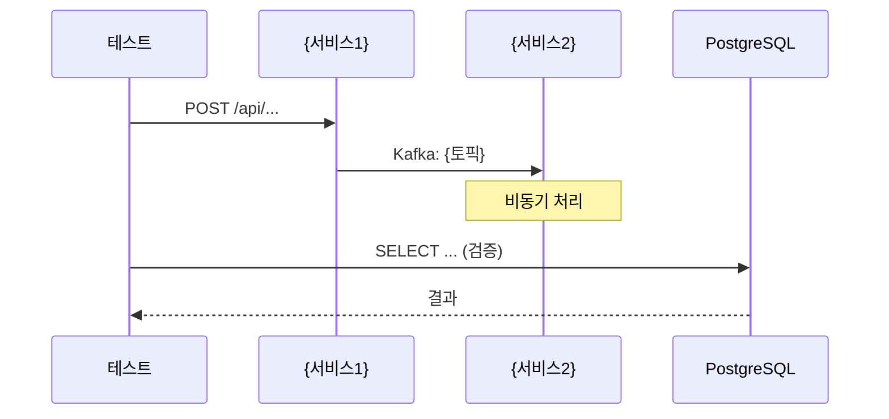
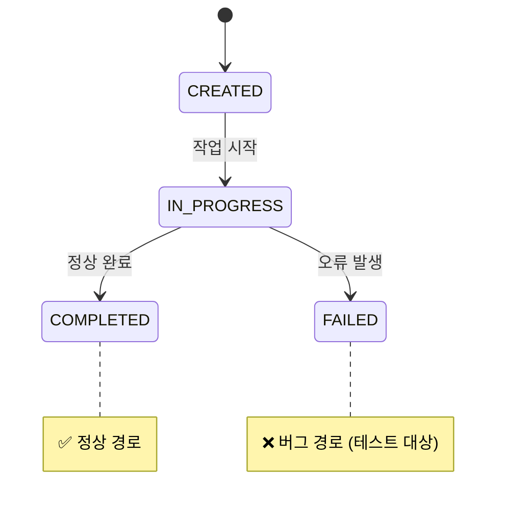
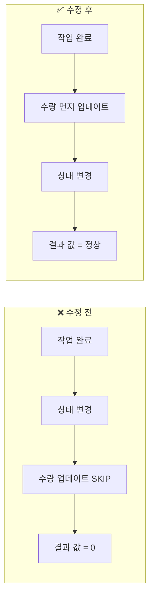

# Confluence 테스트결과 출력 규칙

> **이 파일은 Step 6 (Report) 시작 시 반드시 Read한다.**
> TC 실행 중 수십 턴이 지나면 시작 시 읽은 규칙이 컨텍스트에서 밀려나므로,
> **파일 생성 직전에 이 파일을 읽어야 정확한 구조를 따를 수 있다.**

---

## Step 6 실행 절차

### Step 6-0: 템플릿 Re-Read (최적화됨)

```
1. Read: test/templates/Confluence_테스트결과_템플릿.md (필수 — 섹션 구조)
2. Read: {ctx.ticket_folder}/.mermaid_urls_{ticket}.json (reporter Step 2에서 generate_mermaid_urls.py로 생성, 없으면 스킵)
3. (선택) Read: test/examples/test-evidence-examples.md — 근거 형식이 불확실할 때만
4. 템플릿의 섹션 구조를 확인하고, 아래 체크리스트와 대조
5. 모든 필수 섹션이 포함되도록 문서를 구성한 후 Write
```

> **핵심 포맷 규칙은 test-run.md Step 6에 인라인**되어 있으므로,
> 대부분의 경우 3번 Re-Read 없이 진행 가능하다.

### Step 6-1: Confluence 테스트결과 문서 생성 (새 파일)

- 파일명: `{ticket}_Confluence_테스트결과_v{N}.{M}_{YYYY-MM-DD}.md`
- 기존 파일과 겹치지 않는지 한번 더 확인
- Mermaid 다이어그램은 mermaid.live URL 링크로 변환

### Step 6-2: 템플릿 구조 컴플라이언스 자기 검증 (필수!)

> 문서 Write 직후, 아래 체크리스트를 검증한다. 누락 항목이 있으면 즉시 수정한다.

```
[ ] 제목 형식: # [{ticket}] {기능명} 테스트문서
[ ] 연관 서비스: Repository / Client / 외부연동채널 3분류
[ ] 테스트 대상 Jira 티켓: Jira 링크 포함
[ ] 용어 정의: 용어 / 설명 / 데이터 출처 테이블
[ ] API 응답 필드 안내: 생략된 Root/하위 레벨 필드 명시
[ ] 테스트 흐름: mermaid.live URL (sequenceDiagram)
[ ] 상태 전이: mermaid.live URL (stateDiagram-v2)
[ ] 사전 조건 DB 검증 (종합): 데이터 흐름 + 검증 쿼리
[ ] 근거 작성 규칙: Level of Evidence 참조 테이블
[ ] TC 선정 이유: 각 TC 제목 아래에 `> **선정 이유**: ...` blockquote
[ ] TC 테이블 형식: | 확인 | 검증대상 (위치) | 검증 질문 및 기대결과 | (3열)
[ ] TC 기대값 도출 트리: 각 TC에 ASCII 트리 포함 (① Source → ② Transform → ③ Filter → ④ Outcome)
    - 기대결과의 모든 수치가 트리에서 역산 가능해야 함
    - 도출 불필요(고정값)인 경우 "④ 기대결과: {값} (고정값)" 1줄로 갈음
[ ] TC 검증 diff 테이블: Pass TC는 | # | 검증 항목 | 기대 | 실제 | 판정 | 테이블로 통일
    - Fail TC는 축약하지 않음 (Level 4 형식 유지)
[ ] TC 상세 확인내용: [Pass 근거] 또는 [Fail 근거] 형식
[ ] Pass 근거: 번호 리스트 + 기대/실제/증거 3행 분리
[ ] Fail 근거: Level 4 필수 (근본 원인 + 개발자 액션 + 재현 조건)
[ ] 전체 결과 요약: | 시나리오 | TC | 결과 | 컨테이너 | 핵심 검증 | + pie chart
[ ] 결론 및 권장 사항: 릴리즈 권장 테이블 + 후속 조치 테이블
[ ] 테스트 정보: 환경/인증/DB/Workplace/일시/수행자/검증방법/시트버전/결과버전
```

> **누락 1개라도 있으면**: 해당 섹션을 추가하여 파일을 다시 Write한다.
> **"이 섹션은 해당 없음"인 경우**: 해당 없음 사유를 기재한다 (섹션 자체는 유지).

### Step 6-3: 실행로그 생성 (선택)
- 파일명: `{ticket}_실행로그.json`

---

## Confluence 마크다운 포맷 규칙 (반드시 준수!)

> 0. **이전 버전 비교 금지** — 테스트 결과는 해당 실행의 사실만 기록. "v{N-1} 대비 변경", "이전 결과: FAIL → PASS" 등 금지. 비교는 사용자 요청 시 별도 수행.
> 1. **테이블에 코드블록/`<br>` 넣지 않는다** — 테이블은 3열(확인, 검증대상, 검증질문)만, 상세확인내용은 테이블 아래에 독립 섹션으로 작성
> 2. **코드블록은 항상 독립** — ` ```json ``` ` 은 테이블 밖에서 단독 블록으로 작성
> 3. **`<br>` 사용 금지** — Confluence에서 리터럴 텍스트로 표시됨. 대신 마크다운 줄바꿈 사용
> 4. **확인 표시** — `[x]` 대신 ✅ 이모지 사용 (확인 컬럼, 검증 결과 등)
> 5. **JSON 필드 줄바꿈** — 모든 JSON 필드는 각각 별도 줄에 작성 (한 줄 압축 금지)
> 6. **검증 주석은 blockquote** — `> → ✅ 해석 내용` 형태로 코드블록 아래에 작성
> 7. **사전 조건 검증 필수** — 기대결과에 사용된 수치(수량, 주문 수, 상태)의 출처를 DB 쿼리로 증명. "cty=5"처럼 출처 불명의 숫자를 쓰지 않는다
> 8. **API 응답 필드 생략 시 명시** — 전체 응답에서 일부만 발췌한 경우 "(검증 대상 필드만 발췌)" 및 생략된 필드 목록 기재
> 9. **약어/도메인 용어는 용어 정의 참조** — 문서 앞부분의 "용어 정의" 테이블에 정의된 용어만 사용. 미정의 약어 사용 금지
> 10. **JSON 전체 덤프 금지** — API 응답은 검증 대상 필드만 발췌. 생략된 필드는 "API 응답 필드 안내"에서 일괄 안내. 발췌 시 "(검증 대상 필드만 발췌)" 명시
> 11. **동일 데이터 1회 기술** — 같은 컨테이너/엔티티를 여러 TC에서 사용 시: 첫 TC에서 전체 기술, 이후 TC는 `> **데이터**: TC-{N}과 동일 — 도출 트리 및 응답은 TC-{N} 참조` + 추가 검증 포인트만
> 12. **Pass 근거는 diff 테이블** — "기대/실제/증거" 3행 반복 대신 검증 diff 테이블(| # | 검증 항목 | 기대 | 실제 | 판정 |) 1개로 통일. 해석은 `> → ✅` blockquote 1줄

---

## 근거 작성 형식

**템플릿 참조**: `test/templates/Confluence_테스트결과_템플릿.md` 를 1:1 대응시킨다. 임의로 섹션을 생략하거나 형식을 변경하지 않는다.

**근거 작성 참조**: `test/examples/test-evidence-examples.md` 를 읽고 Pass/Fail 근거 형식을 적용한다.
- Pass TC: `[Pass 근거]` — 도출 트리(사전 조건 확인) + 검증 diff 테이블(기대/실제/판정) + API 응답(검증 필드만 발췌) + `> → ✅` 해석
- Fail TC: `[Fail 근거]` + `[근본 원인 분석]` + `[증거 자료]` + `[개발자 액션]` 형식 (Level 4 필수)

### 증거 유형별 상세확인내용 작성

- **API 응답 검증**: `**API 요청**: URL` → 독립 코드블록으로 `실제 응답 JSON` → `> → ✅ 기대값 비교`
- **DB 상태 검증**: `**검증 쿼리**:` → 독립 코드블록으로 `SQL` → `> → ✅ 상태 전이 설명`
- **UI 화면 검증**: `` → `> → ✅ 화면 요소 확인`
- **복합 검증**: 해당하는 모든 증거를 위 형식으로 각각 독립 섹션으로 포함

{UI 검증이 있는 TC의 경우 스크린샷 첨부}


---

## Mermaid 다이어그램 생성 규칙

테스트결과와 Confluence 문서에 Mermaid 다이어그램을 포함하여 이해도를 높인다.

### 필수 다이어그램 (모든 테스트 결과에 포함)

#### 1) 결과 요약 파이차트

> 실제 PASS/FAIL/N/T/N/A 숫자를 반영한다.

#### 2) 테스트 실행 흐름 (sequenceDiagram)

> 실제 테스트에서 수행한 API 호출, Kafka 이벤트, DB 쿼리를 시간 순으로 표현한다.
> 서비스는 실제 관여한 서비스만 포함한다.

#### 3) 상태 전이도 (stateDiagram-v2)

> 테스트 대상 엔티티(요청/작업/트랜잭션 등)의 상태 흐름을 표현한다.
> 정상 경로와 비정상 경로(버그/에러)를 구분한다.
> 테스트에서 검증하는 상태 전이에 note를 추가한다.

### 상황별 추가 다이어그램

#### 4) 서비스 간 데이터 흐름 (flowchart) — 여러 서비스가 관여할 때
```mermaid
flowchart TD
    A[{서비스A}] -->|요청생성| B[{서비스B}]
    B -->|작업지시| C[{서비스C}]
    C -->|데이터처리| D[{서비스D}]
    B -->|외부연동| E[{외부시스템}]

    style C fill:#ff6b6b,color:#fff
```
> 변경/버그가 발생한 서비스를 빨간색으로 강조한다.

#### 5) Before/After 비교 (flowchart) — 버그 수정 전후 비교 시

> 버그 수정이나 로직 변경의 전후 차이를 시각적으로 보여준다.

### 생성 규칙

| 다이어그램 | 테스트결과 | Confluence | 조건 |
|-----------|----------|-----------|------|
| 파이차트 | ✅ | ✅ | 항상 |
| 시퀀스 다이어그램 | ✅ | ✅ | 항상 |
| 상태 전이도 | ✅ | ✅ | 상태 변화가 있는 엔티티가 있을 때 |
| 서비스 흐름도 | 선택 | ✅ | 2개 이상 서비스가 관여할 때 |
| Before/After | 선택 | ✅ | 버그 수정 / 로직 변경 테스트일 때 |

> **실제 데이터를 반영한다.** 템플릿의 placeholder가 아닌, 테스트에서 실제로 호출한 API, 확인한 상태, 결과 숫자를 사용한다.

### Mermaid 다이어그램 생성 흐름 (3단계)

```
[Step 1] generate_mermaid_diagrams.py  → _mermaid_drafts.json (Python 골격)
    ↓
[Step 2] LLM 검토 + 보강 + Before/After 직접 작성
    ↓
[Step 3] generate_mermaid_urls.py      → pako URL 변환 (기존과 동일)
```

- **Step 1**: test-reporter Logic Flow에서 자동 호출됨 (reporter Step 2)
- **Step 2**: LLM이 _mermaid_drafts.json의 pie_chart(그대로 사용), sequence/state(Note/보강), before_after(직접 작성)를 결정
- **Step 3**: 아래 배치 스크립트로 최종 URL 생성

### Confluence용 Mermaid → mermaid.live URL 변환 (필수!)

> **Confluence는 Mermaid를 네이티브 렌더링할 수 없다.**
> Confluence 문서에서는 Mermaid 코드블록 대신 **mermaid.live/edit 링크**를 생성한다.

#### 변환 방법 — 배치 스크립트 (권장, 1회 Bash)

> reporter(Step 6) Step 2에서 생성한다. (Step 5에서 사전 생성하지 않음)

모든 다이어그램의 Mermaid 코드를 JSON으로 묶어 **1회 Bash 호출**로 전체 URL을 생성한다:

```bash
python3 $CLAUDE_PROJECT_DIR/.claude/skills/test/tools/generate_mermaid_urls.py <<'MERMAID_INPUT'
{
  "pie_chart": "pie title 테스트 결과\n    \"PASS\" : 10\n    \"FAIL\" : 2",
  "sequence": "sequenceDiagram\n    participant T as 테스트\n    participant S as 서비스\n    T->>S: GET /api/...",
  "state": "stateDiagram-v2\n    [*] --> CREATED\n    CREATED --> COMPLETED",
  "before_after": "flowchart LR\n    subgraph Before\n    B1[Step1]\n    end"
}
MERMAID_INPUT
```

출력:
```json
{
  "pie_chart": "https://mermaid.live/edit#pako:...",
  "sequence": "https://mermaid.live/edit#pako:...",
  "state": "https://mermaid.live/edit#pako:...",
  "before_after": "https://mermaid.live/edit#pako:..."
}
```

> **핵심**: 다이어그램 N개를 개별 Bash N회가 아닌, **1회 Bash로 전부 생성**.

#### 폴백: 개별 생성 (배치 스크립트 실패 시에만)

```bash
python3 -c "
import json, zlib, base64
code = '''여기에 Mermaid 코드'''
state = json.dumps({'code': code, 'mermaid': json.dumps({'theme': 'default'}), 'updateDiagram': True, 'rough': False})
compressed = zlib.compress(state.encode('utf-8'), 9)
b64 = base64.urlsafe_b64encode(compressed).rstrip(b'=').decode('ascii')
print(f'https://mermaid.live/edit#pako:{b64}')
"
```

#### Confluence 문서에서의 표기

Mermaid 코드블록 대신 **링크**로 표기한다:

```markdown
## 테스트 흐름
[테스트 실행 흐름 (Sequence Diagram)](https://mermaid.live/edit#pako:eNp1Ul1P...)

## 상태 전이
[상태 전이도 (State Diagram)](https://mermaid.live/edit#pako:aBcDeF...)

## 테스트 결과 요약
[결과 요약 (Pie Chart)](https://mermaid.live/edit#pako:xYzAbC...)
```

#### 변환 규칙

| 항목 | 테스트결과 파일 | Confluence 파일 |
|------|---------------|----------------|
| Mermaid 표기 | 원본 코드블록 (` ```mermaid `) | **mermaid.live URL 링크** |
| 링크 텍스트 | N/A | `[{다이어그램 제목} ({유형})]({URL})` |
| 코드블록 유지 | ✅ | ❌ (링크로 대체) |
| 생성 시점 | reporter Step 2 (generate_mermaid_urls.py) | reporter Step 2 URL을 삽입 |

> Mermaid 다이어그램은 **reporter Step 2에서 배치 생성**하고 Step 6 문서 작성 시 URL을 삽입한다.

---

## 출력 파일 형식

### 필수: Confluence 테스트결과 (새 버전)

`{ctx.ticket_folder}/{ticket}_Confluence_테스트결과_v{N}.{M}_{YYYY-MM-DD}.md`

```
## 테스트 결과 요약

| 시나리오 | 결과 | 비고 |
|---------|------|------|

**전체 결과: {PASS/FAIL} ({N}/{N})**

[결과 요약 (Pie Chart)]({mermaid.live URL — Python으로 생성})

## 테스트 정보
| 항목 | 내용 |
|------|------|
| 테스트 환경 | Staging |
| 테스트 일시 | {YYYY-MM-DD} |
| 테스트 수행자 | Claude |
| 검증 방법 | MCP PostgreSQL DB 쿼리 + API |
| 테스트시트 버전 | v{N} |
| 테스트결과 버전 | v{N}.{M} |
```

### 선택: 실행 로그

`{ctx.ticket_folder}/{ticket}_실행로그.json`

```json
{
  "feature": "{기능명}",
  "ticket": "{ticket}",
  "executed_at": "2026-02-09T...",
  "sheet_version": "v{N}",
  "result_version": "v{N}.{M}",
  "scenarios": {
    "scenario_1": {
      "name": "...",
      "data_source": "existing_db | api_created | skipped",
      "steps": [
        {"action": "...", "result": "SUCCESS|FAILED", "detail": "..."}
      ],
      "verdict": "PASS | FAIL | SKIPPED"
    }
  },
  "summary": {"pass": 0, "fail": 0, "skipped": 0}
}
```
